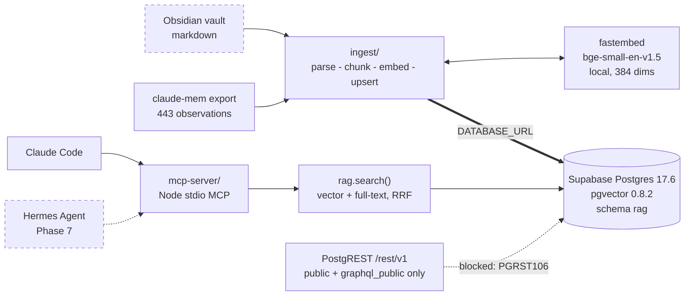

# agentic-harness

An agentic engineering harness rebuilt on native Claude Code primitives, plus a
Postgres + pgvector retrieval store that unifies an Obsidian vault with six
months of migrated agent-memory history.

Two problems, one repo:

1. **The harness had rotted.** Six months of accumulated configuration —
   71 always-on skills, 58 custom agents, 60 slash commands, 22 hooks and 220
   permission rules — most of it either broken or reimplementing something Claude
   Code now does natively. Phase 2 deleted it and rebuilt on built-ins.
2. **Memory was tied to a leaky daemon.** The previous memory system stored its
   real data in SQLite but ran a vector layer that leaked orphan processes and
   held file locks. The data was worth keeping; the machinery was not. It was
   exported and is being re-homed in Postgres.

The result is a single retrieval store that any agent can query — Claude Code
today, a second agent later — through one MCP server and one SQL function.

---

## Architecture at a glance



Dashed = designed, not built.

- **Storage** — Supabase Postgres with pgvector. Two tables: `rag.documents`
  (one row per source artifact) and `rag.chunks` (embedded slices, 384-dim
  vector plus a generated `tsvector`).
- **Embeddings** — `BAAI/bge-small-en-v1.5` run locally through `fastembed`.
  384 dimensions, cosine distance, HNSW index. No API key, no per-token cost,
  nothing leaves the machine.
- **Retrieval** — one function, `rag.search()`. It runs a vector kNN search and a
  full-text search independently, then fuses the two ranked lists with Reciprocal
  Rank Fusion. Every client goes through it, so no two agents can drift apart on
  what "relevant" means.
- **Access** — RLS enabled with zero policies, and the `rag` schema is not
  exposed to the REST API at all. Clients connect over **direct Postgres**
  (`DATABASE_URL`) with the service role. A `supabase-js` RPC returns
  `HTTP 406 PGRST106` and cannot reach the store — that is deliberate, not a
  misconfiguration.

Full detail in [docs/](./docs/README.md).

---

## Status

Phase-by-phase. **Phases 4, 5, 7 and 8 are not built** — they are designed and
documented as designs, not as behaviour.

| Phase | What | State |
| --- | --- | --- |
| 0 | Archive the old harness | ✅ Done — 839 files, 210 MB, `~/.claude-archive/2026-09-09/` |
| 1 | Export claude-mem history | ✅ Done — 4 JSON files + verified 56 MB snapshot |
| 2 | Teardown and rebuild the harness | ✅ Done — 71→12 skills, 58→0 agents, 60→0 commands, 22→0 hooks, 220→0 permission rules |
| 3 | pgvector schema | ✅ Done — schema `rag` applied and verified against the live project |
| 4 | Vault + ingestion pipeline | 🚧 In progress — `ingest/` is being written; 0 rows ingested |
| 5 | Retrieval MCP server | 🚧 In progress — `mcp-server/` is being written |
| 6 | Dev cycle | ✅ Mostly done — `CLAUDE.md` rewritten with required gates |
| 7 | Second agent on the same store | ⏸ Deferred until 0–6 land. Schema is already agent-neutral |
| 8 | Self-evolution loop | ⏸ Deferred. Repo is currently unlicensed; re-check before adopting anything |
| 9 | Docs + diagrams | 🚧 This |

What is actually verifiable right now:

- The `rag` schema exists on project `goultdzqcavefcgnifdy`, Postgres 17.6,
  pgvector 0.8.2, with all 11 indexes including HNSW `vector_cosine_ops`.
- `rag.search()` is defined and callable.
- `rag.documents` and `rag.chunks` both contain **0 rows**.
- There is no test suite yet, because there is no application code yet.
- `DATABASE_URL` has not been provided yet, so nothing has connected with
  application credentials.

---

## Repo layout

```
agentic-harness/
├── README.md            you are here
├── CONTEXT.md           shared context every agent on this project reads first
├── .env.example         connection variables — copy to .env, never commit .env
├── docs/
│   ├── README.md        documentation index
│   ├── architecture.md  system design and the decisions behind it
│   ├── harness-reset.md what was deleted in Phase 2 and why
│   ├── ingestion.md     parse → chunk → embed → upsert
│   ├── embeddings.md    tokenization → 384-dim vectors → HNSW
│   └── retrieval.md     hybrid search and Reciprocal Rank Fusion
├── db/
│   ├── README.md        project ref, access model, migration mirror
│   └── migrations/      SQL mirroring what is applied to Supabase
├── ingest/              Python ingestion pipeline (uv) — in progress
└── mcp-server/          Node/TS stdio MCP retrieval server — in progress
```

The repo lives at `C:/Users/estac/agentic-harness`, deliberately **outside
OneDrive**. `.git` and OneDrive sync corrupt each other.

---

## Quickstart

### Prerequisites

| Tool | Status on the development machine |
| --- | --- |
| Supabase project with pgvector | Provisioned — `goultdzqcavefcgnifdy`, pgvector 0.8.2 |
| `uv` | 0.9.26 installed |
| Python | **Not installed.** Run `uv python install` first |
| Node | 24.13.0 |
| Docker | Installed but the daemon is not running — nothing here needs it |

### 1. Configure credentials

```bash
cp .env.example .env
# fill in DATABASE_URL, SUPABASE_SERVICE_ROLE, SUPABASE_URL
```

`.env` is gitignored. Nothing in this repo hardcodes a connection string; every
component reads these variables from the environment.

**Connect over direct Postgres.** The `rag` schema is intentionally not exposed
to PostgREST, so `DATABASE_URL` is the credential that matters and a
`supabase-js` RPC will not work. See
[docs/architecture.md](./docs/architecture.md#why-direct-postgres-and-not-postgrest).

### 2. Apply the database schema

Already applied to the project above. To reproduce it elsewhere, run the files in
`db/migrations/` in filename order:

```bash
psql "$DATABASE_URL" -f db/migrations/20260909170410_create_rag_schema.sql
psql "$DATABASE_URL" -f db/migrations/20260909170451_create_rag_hybrid_search.sql
```

Against the live Supabase project, schema changes go through the Supabase MCP
`apply_migration` tool instead — it authenticates without a local secret.

### 3. Verify

```sql
select
  (select count(*) from rag.documents) as documents,
  (select count(*) from rag.chunks)    as chunks,
  (select extversion from pg_extension where extname = 'vector') as pgvector;
```

A fresh install returns `0, 0, 0.8.2`.

### 4. Ingest, and search

**Not available yet.** `ingest/` and `mcp-server/` are Phases 4 and 5, both in
progress. Once they land, ingestion will be a batch command over the claude-mem
export and the vault, and retrieval will be an MCP tool registered with Claude
Code that calls `rag.search()`.

Until then the store is queryable directly, and returns nothing:

```sql
select doc_title, chunk_content, fused_score
from rag.search(query_text => 'retrieval ranking', match_count => 5);
```

---

## Windows path gotcha

Native Windows binaries — `node.exe`, `sqlite3.exe`, the Python interpreter —
cannot read MSYS-style `/c/Users/...` paths. `node` silently resolves such a path
to `C:\c\Users\...` and fails with `ENOENT`, which looks like a missing file
rather than a malformed path.

- Pass `C:/Users/...` to any native binary.
- Only the bash shell itself — redirects, `ls`, `cp`, `find` — understands
  `/c/...`.
- A script needing both should bind two separate variables.

This has already broken two commands during this project.

---

## Conventions

- Conventional commits: `feat:`, `fix:`, `docs:`, `test:`, `chore:`, `refactor:`.
- Files 200–400 lines typical, 800 max.
- Errors handled explicitly, never silently swallowed. Input validated at
  boundaries.
- Tests required, 80%+ coverage, once there is code to test.
- No secrets in code, ever.
- Diagrams are mermaid in fenced blocks so they render on GitHub without a build
  step.

---

## A note on honesty in this documentation

This repo documents a system that is roughly two-thirds built. Where something is
designed but not implemented, it says so at the top of the file and in the status
table above. No passing test suite is claimed, because there is not one. No
ingestion results are reported, because nothing has been ingested.

If a document here describes something in the present tense, it should be
verifiable against the live database or the filesystem. If you find one that is
not, that is a bug in the documentation.
