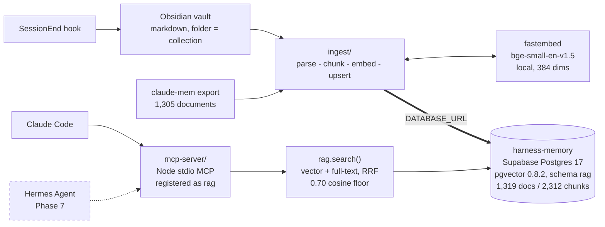

# agentic-harness

An agentic engineering harness rebuilt on native Claude Code primitives, plus a
Postgres + pgvector retrieval store that unifies an Obsidian vault with six
months of migrated agent-memory history — searchable by meaning and by keyword,
filtered by the project or class it came from.

Two problems, one repo:

1. **The harness had rotted.** Six months of accumulated configuration —
   71 always-on skills, 58 custom agents, 60 slash commands, 22 hooks and 220
   permission rules — most of it either broken or reimplementing something Claude
   Code now does natively. Phase 2 deleted it and rebuilt on built-ins.
2. **Memory was tied to a leaky daemon.** The previous memory system stored its
   real data in SQLite but ran a vector layer that leaked orphan processes and
   held file locks. The data was worth keeping; the machinery was not. It was
   exported and re-homed in Postgres.

The result: every Claude Code session ends by writing itself into the vault, the
vault is embedded into Postgres, and any agent can query the whole history
through one MCP server and one SQL function.

---

## Architecture at a glance



Dashed = designed, not built. Everything else is live.

- **Storage** — its own Supabase project, `harness-memory`. Two tables:
  `rag.documents` (one row per source artifact, tagged with a `collection`) and
  `rag.chunks` (embedded slices, 384-dim vector plus a generated `tsvector`).
- **Embeddings** — `BAAI/bge-small-en-v1.5` run locally through `fastembed` on
  both the ingestion side (Python) and the query side (Node). 384 dimensions,
  cosine distance, HNSW index. No API key, no per-token cost, nothing leaves
  the machine. Parity between the two runtimes is measured, not assumed.
- **Retrieval** — one function, `rag.search()`. It runs a vector kNN search and a
  full-text search independently, fuses the two ranked lists with Reciprocal
  Rank Fusion, caps chunks per document, and applies a cosine relevance floor so
  an off-topic question returns nothing instead of its nearest junk.
- **Capture** — a `SessionEnd` hook writes each finished session to
  `vault/<projects|classes>/<collection>/sessions/<session_id>.md` as redacted
  markdown: one note per session, keyed on the repository rather than the folder,
  carrying its branch, commits, PRs, phase, tags and resume chain. Rewrites merge
  into what is already there, so a tag typed by hand survives. The next ingest
  run embeds it; unchanged notes cost nothing.
- **Access** — RLS enabled with zero policies, and the `rag` schema is not
  exposed to the REST API at all. Clients connect over **direct Postgres**
  (`DATABASE_URL`) with the service role. A `supabase-js` RPC returns
  `HTTP 406 PGRST106` and cannot reach the store — deliberate, not a
  misconfiguration.

Full detail in [docs/](./docs/README.md).

### ⚠ Two stores exist. Never cross them.

A second, unrelated RAG store lives in the `bb2dash` project: class materials
embedded with `gte-small`. It is also 384-dimensional, so a query vector from
one model runs against the other's rows without error and returns
confidently-ranked nonsense. This repo owns `harness-memory` only; the MCP
server refuses a `DATABASE_URL` naming the bb2dash project.

---

## Status

| Phase | What | State |
| --- | --- | --- |
| 0 | Archive the old harness | ✅ Done — 839 files, 210 MB, `~/.claude-archive/2026-09-09/` |
| 1 | Export claude-mem history | ✅ Done — 4 JSON files + verified 56 MB snapshot |
| 2 | Teardown and rebuild the harness | ✅ Done — 71→12 skills, 58→0 agents, 60→0 commands, 22→1 hooks, 220→0 permission rules |
| 3 | pgvector schema | ✅ Done — migrations applied to `harness-memory` and mirrored in `db/migrations/` |
| 4 | Vault + ingestion pipeline | ✅ Done — 1,319 documents / 2,312 chunks / 27 collections; vault open in Obsidian with Fall 2026 class folders and bb2dash materials; 261 tests |
| 5 | Retrieval MCP server | ✅ Done — registered with Claude Code as `rag`; 117 tests; verified against the live store |
| 6 | Dev cycle | ✅ Done — user-level `~/.claude/CLAUDE.md` rewritten with required gates |
| 7 | Second agent on the same store | ⏸ Deferred. Schema is already agent-neutral |
| 8 | Self-evolution loop | ⏸ Deferred |
| 9 | Docs + diagrams | ✅ This |

What is verifiable right now, against the live project:

- `rag.documents` holds 1,319 rows across 27 collections; `rag.chunks` holds
  2,312, every one with a 384-dim embedding and a generated `tsv`.
- `rag.search()` returns real results with real cosine similarities: relevant
  hits on this corpus score 0.79–0.87, unrelated queries 0.48–0.66, and the
  0.70 floor turns "banana bread recipe" into an honest empty result.
- The `SessionEnd` hook has been observed firing unprompted; its note was
  ingested on the next run as the store's first `source='obsidian'` document.
- `npm test` in `mcp-server/` passes 117 tests; `uv run pytest` in `ingest/`
  passes 261; `npm test` in `hooks/` passes 163. All three mock the database,
  the model and the network, so they need no credentials.

---

## Repo layout

```
agentic-harness/
├── README.md            you are here
├── CONTEXT.md           shared context every agent on this project reads first
├── .env.example         connection variables — copy to .env, never commit .env
├── certs/prod-ca.crt    Supabase's public root CA, pinned by both clients
├── docs/
│   ├── README.md        documentation index
│   ├── architecture.md  system design and the decisions behind it
│   ├── harness-reset.md what was deleted in Phase 2 and why
│   ├── ingestion.md     parse → chunk → embed → upsert, vault layout, session capture
│   ├── embeddings.md    tokenization → 384-dim vectors → HNSW, runtime parity
│   ├── retrieval.md     hybrid search, RRF, the relevance floor, the contract
│   └── tags.md          the controlled tag vocabulary for session notes
├── db/
│   ├── README.md        project ref, connection gotchas, access model, migration mirror
│   └── migrations/      SQL mirroring what is applied to harness-memory
├── hooks/               the SessionEnd capture hook, its tests and the installer
├── ingest/              Python ingestion pipeline (uv)
└── mcp-server/          Node/TS stdio MCP retrieval server
```

The repo lives at `C:/Users/estac/agentic-harness`, deliberately **outside
OneDrive**. `.git` and OneDrive sync corrupt each other. The vault lives *inside*
OneDrive, because plain markdown syncs fine.

---

## Quickstart

### Prerequisites

| Tool | Notes |
| --- | --- |
| Supabase project with pgvector | `harness-memory` (`hqkytnyiiuxovnnyixye`), pgvector 0.8.2 |
| `uv` | 0.9.26+; it manages Python itself (`uv python install 3.12`) |
| Node | ≥ 20.11 (developed on 24.13.0) |
| Docker | Not needed. Nothing here has a daemon |

### 1. Configure credentials

```bash
cp .env.example .env
# fill in DATABASE_URL — the session pooler, postgres.<ref> username, port 5432
```

`.env` is gitignored. Nothing in this repo hardcodes a connection string. The
connection details that each cost an hour to discover are in
[db/README.md](./db/README.md#connection-specifics--each-of-these-cost-an-hour).

### 2. Apply the database schema

Already applied to `harness-memory`. To reproduce it elsewhere, run the files in
`db/migrations/` in filename order:

```bash
for f in db/migrations/*.sql; do psql "$DATABASE_URL" -f "$f"; done
```

Against the live Supabase project, schema changes go through the Supabase MCP
`apply_migration` tool instead — it authenticates without a local secret. The
files here are the mirror, not the mechanism.

### 3. Ingest

```bash
cd ingest && uv sync && uv run pytest
uv run ingest --source claude-mem --path C:/Users/estac/.claude-archive/2026-09-09/claude-mem-export
uv run ingest --source obsidian   --path "C:/Users/estac/OneDrive - Syracuse University/vault"
```

Re-run the vault ingest whenever you like; `content_hash` skips every unchanged
note, so a run after one session embeds one document. A note whose *frontmatter*
changed but whose body did not — a session concluded by the nightly sweep, say —
gets its `title` and `metadata` refreshed with one UPDATE and no embedding. See
[ingest/README.md](./ingest/README.md) for every flag, including the repeatable
`--only` and the guarded `--prune` orphan sweep.

Class materials are a separate, read-only step: `uv run export-materials`
copies bb2dash's extracted text into `classes/<course>/materials/` as notes
flagged `ingest: false`, so they are readable in Obsidian but searched through
the `bb2dash` MCP server, never embedded here (the two stores use different
models). Details in [docs/ingestion.md](./docs/ingestion.md).

### 4. Register the retrieval server with Claude Code

```powershell
cd mcp-server; npm install; npm run build; npm test
```

MCP servers are configured with the `claude mcp` CLI, which writes user-scope
servers to `~/.claude.json` (not `settings.json`). Build the JSON from `.env` so
the secret never appears on a command line:

```bash
JSON=$(node -e '
const env=Object.fromEntries(require("fs").readFileSync(".env","utf8").split(/\r?\n/)
  .filter(l=>/^[A-Z_]+=/.test(l)).map(l=>{const i=l.indexOf("=");return[l.slice(0,i),l.slice(i+1).trim()]}));
process.stdout.write(JSON.stringify({type:"stdio",command:"C:/Program Files/nodejs/node.exe",
  args:["C:/Users/estac/agentic-harness/mcp-server/dist/index.js"],
  env:{DATABASE_URL:env.DATABASE_URL,
       DATABASE_CA_CERT:"C:/Users/estac/agentic-harness/certs/prod-ca.crt",
       FASTEMBED_CACHE_DIR:"C:/Users/estac/agentic-harness/mcp-server/.fastembed-cache"}}))')
claude mcp add-json rag "$JSON" -s user
claude mcp list        # rag: ✔ Connected
```

After restarting Claude Code the tools appear as `mcp__rag__search_context` and
`mcp__rag__get_document`. Details in [mcp-server/README.md](./mcp-server/README.md).

### 5. Install the session-capture hook

```bash
cd hooks && npm test          # 163 tests, no dependencies
node install.mjs --dry-run    # what would change in ~/.claude/hooks
node install.mjs              # copy, then verify every file by SHA-256
```

`~/.claude/settings.json` registers
`~/.claude/hooks/session-capture.mjs` as a `SessionEnd` hook. The installer
copies into that directory rather than pointing settings at a checkout: a
worktree gets deleted, and a hook that goes with it takes every future session's
note along. Details in [hooks/README.md](./hooks/README.md).

### 6. Search

From Claude Code, ask anything that depends on past decisions or project
history; the server embeds the query locally and calls `rag.search()`. Or go
straight to SQL:

```sql
select doc_collection, doc_title, vector_similarity, left(chunk_content, 120)
from rag.search(query_text => 'retrieval ranking', match_count => 5);
```

---

## Windows path gotcha

Native Windows binaries — `node.exe`, `sqlite3.exe`, the Python interpreter —
cannot read MSYS-style `/c/Users/...` paths. `node` silently resolves such a path
to `C:\c\Users\...` and fails with `ENOENT`, which looks like a missing file
rather than a malformed path.

- Pass `C:/Users/...` to any native binary.
- Only the bash shell itself — redirects, `ls`, `cp`, `find` — understands
  `/c/...`.
- A script needing both should bind two separate variables.

This has already broken two commands during this project.

---

## Conventions

- Conventional commits: `feat:`, `fix:`, `docs:`, `test:`, `chore:`, `refactor:`.
- Files 200–400 lines typical, 800 max.
- Errors handled explicitly, never silently swallowed. Input validated at
  boundaries.
- Tests required, 80%+ coverage. Both suites run with no credentials.
- No secrets in code, ever.
- Diagrams are mermaid in fenced blocks so they render on GitHub without a build
  step.

---

## A note on honesty in this documentation

If a document here describes something in the present tense, it should be
verifiable against the live database or the filesystem. Phases 7 and 8 are
designs and say so. If you find present-tense prose that you cannot verify, that
is a bug in the documentation — please treat it as one.

## License

MIT — see [LICENSE](./LICENSE).
