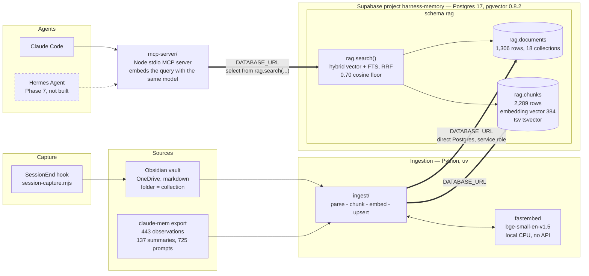
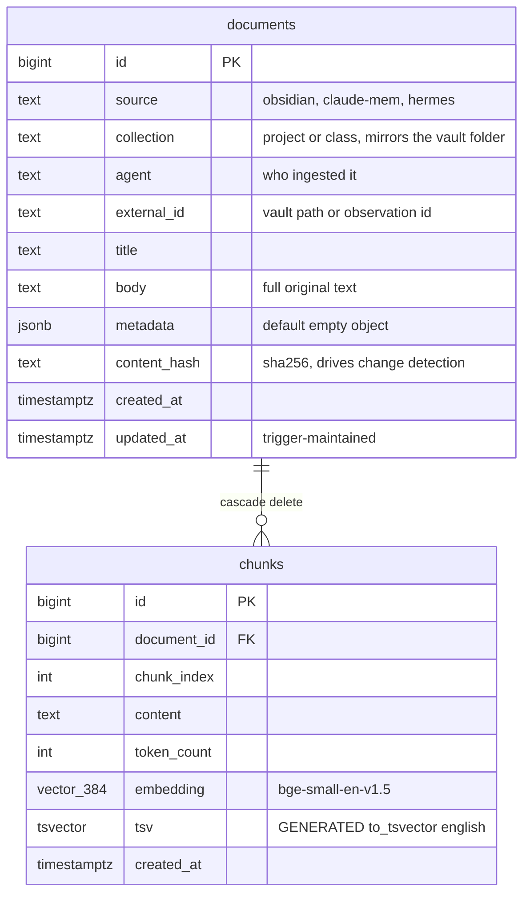
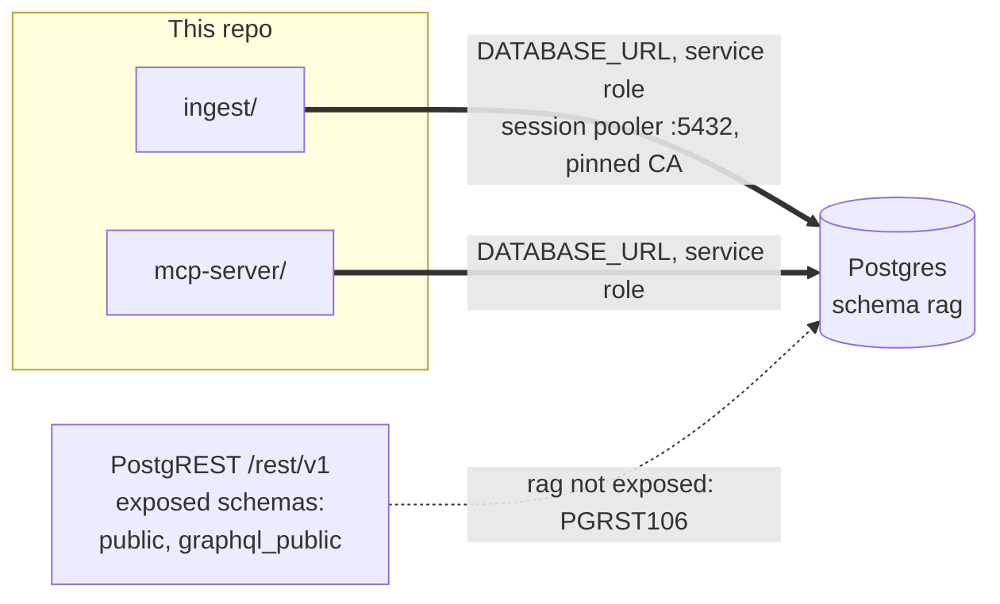

# Architecture

This document describes how the pieces fit together and why each was chosen.
It assumes no prior knowledge of the project. Everything described here is
live and verifiable against the database or the filesystem unless it says
otherwise.

- [System overview](#system-overview)
- [The data store](#the-data-store)
- [Why Supabase and not local Docker](#why-supabase-and-not-local-docker)
- [Why its own project](#why-its-own-project)
- [Why direct Postgres and not PostgREST](#why-direct-postgres-and-not-postgrest)
- [Why the schema is agent-neutral](#why-the-schema-is-agent-neutral)
- [Why one `rag.search()` function](#why-one-ragsearch-function)
- [Security model](#security-model)
- [Component status](#component-status)

---

## System overview

Two things were built, and they meet in the middle.

1. **A harness** — the configuration that shapes how Claude Code behaves on this
   machine. It was torn down and rebuilt on native primitives. See
   [harness-reset.md](./harness-reset.md).
2. **A retrieval store** — a Postgres database holding an Obsidian vault and six
   months of migrated agent-memory history, searchable by meaning as well as by
   keyword, tagged by the project or class each document belongs to.

The store is written by an ingestion pipeline and read by agents through a single
MCP server. New material arrives through a `SessionEnd` hook that writes each
finished Claude Code session into the vault as markdown, where the next ingest
run picks it up.



Dashed boxes are designed but not yet built. Everything else is running.

Three structural properties matter in that picture.

**Agents never issue SQL.** They call one MCP tool, which calls one database
function. Ranking logic lives in exactly one place.

**Markdown first, embeddings second.** A session becomes a vault note before it
becomes vectors. The vault stays human-readable and git-friendly, syncs through
OneDrive, and survives any change of tooling underneath it. The database is a
derived index that can be rebuilt from the vault at any time.

**The folder is the collection.** `vault/projects/agentic-harness/…` lands as
`collection = 'agentic-harness'`, verbatim. That column is what makes "history
by project or class" a filter rather than a guess.

---

## The data store

Two tables. A document is a whole source artifact; a chunk is an embedded slice
of one.



Constraints and indexes that carry real weight:

| Object | Purpose |
| --- | --- |
| `unique (source, external_id)` on documents | Makes re-ingestion idempotent. The same vault note always lands on the same row. |
| `unique (document_id, chunk_index)` on chunks | Chunk N of document D is one row, so re-chunking overwrites rather than duplicates. |
| `content_hash` + btree index | Lets ingestion skip a document whose bytes have not changed. See [ingestion.md](./ingestion.md). |
| btree on `collection` | The project/class filter is an index probe, not a scan. |
| HNSW on `embedding`, `vector_cosine_ops` | Approximate nearest-neighbour search. See [embeddings.md](./embeddings.md). |
| GIN on `tsv` | Full-text search. `tsv` is a stored generated column, so it can never fall out of sync with `content`. |
| GIN on `metadata` (`jsonb_path_ops`) | Filtering by arbitrary source-specific fields without adding columns. |
| `on delete cascade` | Deleting a document takes its chunks with it. No orphan vectors. |

`tsv` being **generated** rather than trigger-maintained is deliberate: there is
no code path that can write `content` and forget the tsvector, because there is
no code path that writes `tsv` at all.

`collection` values are matched with `=`, so case and spacing are load-bearing.
The values migrated from claude-mem are lowercase and some contain spaces
(`wa2 final`, `team project`); vault-derived ones follow folder names. Keep new
folders lowercase-hyphenated. The full live list is in `CONTEXT.md`.

---

## Why Supabase and not local Docker

The obvious alternative was a local Postgres or a local Chroma/Qdrant container.

| | Supabase | Local Docker |
| --- | --- | --- |
| Availability | Always up | Up when the daemon is up |
| Setup cost | Zero — pgvector already enabled | Compose file, volumes, port config |
| Failure mode | Network | Silent — queries fail when the daemon is stopped |
| Reachable from a future non-local agent | Yes | No, without tunnelling |
| Cost | Free tier | Free, but disk and RAM on the workstation |

The deciding fact was concrete: Docker is installed on this machine but the
daemon is not running and there are zero images. A dependency that requires
remembering to start a daemon before an agent can recall anything is a
dependency that will fail at the worst moment. Supabase has no daemon to babysit.

The predecessor stack made this mistake already. claude-mem ran a Chroma vector
store through a wrapper process, and restarting the worker leaked orphan process
chains that then held file locks. Its actual durable store turned out to be
SQLite; Chroma was overhead that could fail. That experience is the reason the
replacement is a managed database with no local moving parts.

---

## Why its own project

The store now lives in a dedicated Supabase project, `harness-memory`
(`hqkytnyiiuxovnnyixye`). It did not start there.

On 2026-09-09 the Supabase free tier's two active-project slots were both taken,
so the first version of the `rag` schema was created inside `bb2dash`, a live
class-materials application, with isolation done at the schema level. Later the
same day `quant-edge-tracker-v2` — which held 0 bets and 0 bankroll rows — was
paused to free a slot, `harness-memory` was created, the migrations were
re-applied there, and the empty `rag` schema was dropped from `bb2dash`.

What project-level isolation buys over schema-level isolation:

- **No shared connection pool.** Heavy ingestion no longer competes with a live
  application for connections. The first full ingest died at document 276 when
  the pooler reaped a long-held connection; that is an easier problem to reason
  about when the pool is yours alone.
- **No shared storage quota.**
- **No blast radius.** A destructive statement typed against the wrong schema can
  no longer reach an application's tables, because they are not in this database.

### Two stores, never crossed

`bb2dash` still has its own retrieval store: class materials embedded with
`gte-small` by the Supabase Edge Runtime, in schema `public`. It is **also
384-dimensional**. A `bge` query vector run against `gte` rows raises no error
and returns confidently-ranked nonsense, because the two models occupy different
vector spaces.

|  | **harness-memory** | **bb2dash** |
| --- | --- | --- |
| Project ref | `hqkytnyiiuxovnnyixye` | `goultdzqcavefcgnifdy` |
| Contents | Session histories by project/class | Class materials + the app |
| Schema | `rag` | `public` |
| Model | `bge-small-en-v1.5`, local fastembed | `gte-small`, server-side |

This repo owns `harness-memory` only. The MCP server refuses a `DATABASE_URL`
containing the bb2dash project ref, and bb2dash's credentials live in its own
repo, not here.

---

## Why direct Postgres and not PostgREST

Supabase gives every project a REST API, and the ordinary way to call a database
function through it is a `supabase-js` RPC. That path is **closed for `rag`, by
design**. Verified by probe on the original host project, and equally true here:

```
POST /rest/v1/rpc/search   (Content-Profile: rag)
  -> HTTP 406  PGRST106
     "Only the following schemas are exposed: public, graphql_public"
```

Both the ingestion pipeline and the MCP server connect over `DATABASE_URL`, a
direct Postgres connection, using the service role.



Two reasons, and they pull in the same direction.

**Attack surface.** Exposing `rag` over REST would put a personal knowledge vault
and six months of engineering history one policy away from an anonymous HTTP
request. RLS would still be the barrier, but the barrier would now be the *only*
thing standing between the corpus and the internet. Leaving the schema unexposed
means there is no request that can reach it at all — a stronger guarantee than a
correct policy, because it does not depend on the policy staying correct. Nothing
in the harness needs browser access, so the exposure buys literally nothing.

**Throughput.** Ingestion writes chunks in bulk. Over PostgREST that is thousands
of HTTP round-trips, each with TLS, JSON serialisation and per-request overhead,
and no way to stream. Over a direct connection it is batched multi-row inserts on
one session — orders of magnitude faster, and the difference compounds every time
the corpus is re-embedded.

The cost is that the harness needs a real Postgres credential and a reachable
database port. The connection details that cost real time to discover — session
pooler not direct host, `postgres.<ref>` username, port 5432 not 6543, Supabase's
own root CA — are recorded in [../db/README.md](../db/README.md).

The practical consequence for anyone writing code here: **do not build a
`supabase-js` RPC path.** It cannot reach `rag.search()`, and the failure is a
406 that reads like a content-negotiation bug rather than a design decision.

---

## Why the schema is agent-neutral

`source` and `agent` are plain `text`, not enums, and nothing in the schema
mentions Claude Code.

The Hermes Agent (Phase 7) is meant to read and write this same store. Had
`source` been an enum, adding it would require an `ALTER TYPE` migration; had
retrieval been shaped around one client's assumptions, a second client would need
its own path and the two would drift.

Instead a new producer is a new string. Ingest `source='hermes'` and it is
searchable immediately, filterable via `filter_source`, and visible to every
existing consumer with no schema change and no code change in the MCP server.

The trade-off is that the database will not stop a typo — `source='obsidan'`
inserts happily. That validation belongs at the ingestion boundary, which is the
one place that knows what it is ingesting.

---

## Why one `rag.search()` function

Retrieval is a database function, not client-side SQL, and every client is
required to go through it.

Hybrid ranking has tunable parts: how many candidates each arm retrieves, the RRF
constant, the per-document cap, the similarity floor, the text-search
configuration. If Claude Code's MCP server and Hermes each hand-rolled their own
query, those parameters would diverge, and the two agents would silently disagree
about what "the most relevant note" is. Debugging that is miserable, because both
look correct in isolation.

One function means one ranking definition, tuned in one migration, applied to
everyone at once. It also keeps the ranking work next to the data — no candidate
rows cross the network only to be discarded by a client-side reranker.

The function's signature has already changed three times. Clients therefore bind
its arguments **by name**, never positionally; the reasons are in
[retrieval.md](./retrieval.md#the-contract).

---

## Security model

Three layers, each of which would be sufficient on its own for a different threat.

- **Not exposed to PostgREST.** No HTTP request reaches `rag`, authenticated or
  otherwise.
- **RLS enabled, zero policies.** Postgres denies all access under RLS unless a
  policy permits it. The service role bypasses RLS. Net effect: only the service
  role reads or writes `rag`.
- **Two credential holders**: the ingestion pipeline and the MCP server, both
  connecting over `DATABASE_URL`. There is no browser client and no per-user
  access model to express.

On secrets:

- **Nothing is hardcoded.** The one credential, `DATABASE_URL`, comes from the
  environment: the repo `.env` for ingestion, the MCP server's env block in
  `~/.claude.json` for retrieval. Neither is committed.
- **`.gitignore` excludes `.env*`** with an explicit exception for `.env.example`.
- **TLS is verified**, against Supabase's pinned root CA (`certs/prod-ca.crt`,
  public). There is deliberately no `rejectUnauthorized: false` option anywhere.
- **Schema changes need no local secret** — they go through the Supabase MCP
  `apply_migration` tool, which authenticates separately.
- **The session-capture hook redacts** before anything reaches the vault: key-like
  environment assignments, connection-string passwords, JWTs, and vendor key
  formats are replaced with `[REDACTED]`. Raw tool output is never copied.

---

## Component status

| Component | Where | State |
| --- | --- | --- |
| Harness rebuild | `~/.claude/` | Done — 71→12 skills, 58→0 agents, 60→0 commands, 1 hook |
| claude-mem export | `~/.claude-archive/2026-09-09/` | Done — 4 JSON files, snapshot verified |
| `rag` schema + `rag.search()` | `db/migrations/` | Applied to `harness-memory`, 3 migrations, verified |
| Ingestion pipeline | `ingest/` | Live — 1,305 claude-mem documents + vault notes; 214 tests |
| Retrieval MCP server | `mcp-server/` | Live — registered with Claude Code as `rag`; 117 tests |
| Obsidian vault | `OneDrive - Syracuse University/vault/` | Live — `projects/`, `classes/`, `daily/` |
| Session capture hook | `~/.claude/hooks/session-capture.mjs` | Live — observed firing unprompted on 2026-09-09, note ingested |
| Hermes Agent | — | Deferred to Phase 7 |
| Self-evolution loop | — | Deferred to Phase 8 |
