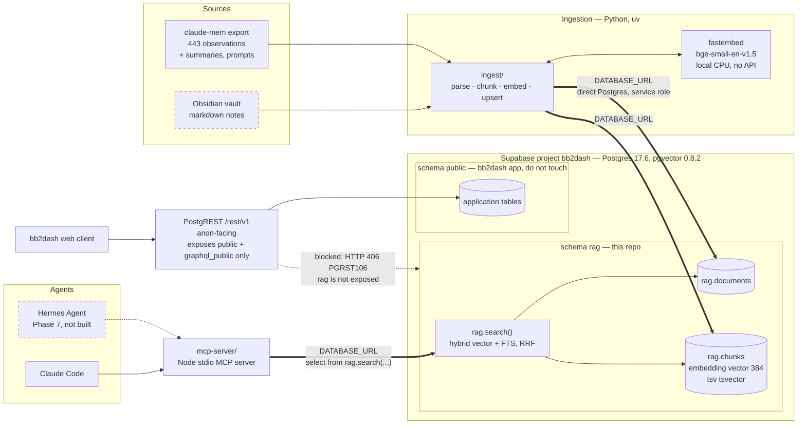
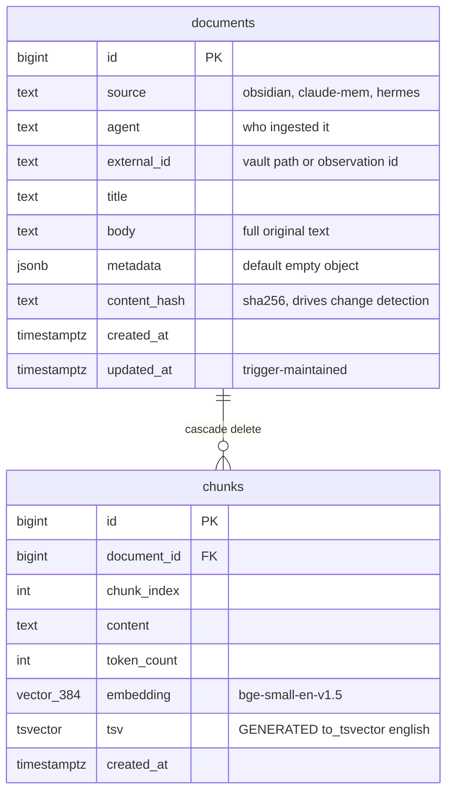
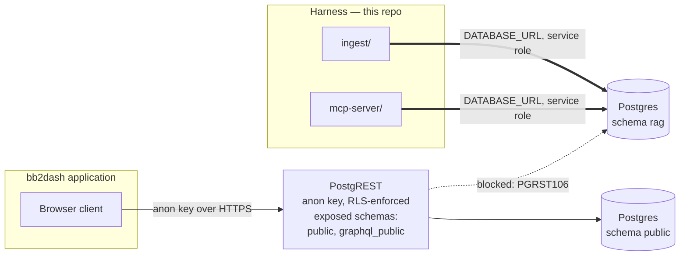

# Architecture

This document describes how the pieces fit together and why each was chosen.
It assumes no prior knowledge of the project.

- [System overview](#system-overview)
- [The data store](#the-data-store)
- [Why Supabase and not local Docker](#why-supabase-and-not-local-docker)
- [Why a `rag` schema inside an existing project](#why-a-rag-schema-inside-an-existing-project)
- [Why direct Postgres and not PostgREST](#why-direct-postgres-and-not-postgrest)
- [Why the schema is agent-neutral](#why-the-schema-is-agent-neutral)
- [Why one `rag.search()` function](#why-one-ragsearch-function)
- [Security model](#security-model)
- [Component status](#component-status)

---

## System overview

Two things are being built, and they meet in the middle.

1. **A harness** — the configuration that shapes how Claude Code behaves on this
   machine. It was torn down and rebuilt on native primitives. See
   [harness-reset.md](./harness-reset.md).
2. **A retrieval store** — a Postgres database holding an Obsidian vault and six
   months of migrated agent-memory history, searchable by meaning as well as by
   keyword.

The store is written by an ingestion pipeline and read by agents through a single
MCP server. Nothing else talks to it.



Dashed boxes are designed but not yet built. The Obsidian vault does not exist
yet either — no vault is registered, `obsidian.json` is empty. The claude-mem
export is real and on disk.

Two structural properties matter in that picture.

**Agents never issue SQL.** They call one MCP tool, which calls one database
function. Ranking logic lives in exactly one place.

**The harness and the host application reach the database by different routes.**
`bb2dash` serves its own schema over an anon-facing PostgREST endpoint. The
harness bypasses that entirely and connects to Postgres directly with the service
role. The dotted edge into `rag` is a path that does *not* work: PostgREST is
configured to expose only `public` and `graphql_public`, so a REST call into the
`rag` schema is refused. The next section explains why that is deliberate.

---

## The data store

Two tables. A document is a whole source artifact; a chunk is an embedded slice
of one.



Constraints and indexes that carry real weight:

| Object | Purpose |
| --- | --- |
| `unique (source, external_id)` on documents | Makes re-ingestion idempotent. The same vault note always lands on the same row. |
| `unique (document_id, chunk_index)` on chunks | Chunk N of document D is one row, so re-chunking overwrites rather than duplicates. |
| `content_hash` + btree index | Lets ingestion skip a document whose bytes have not changed. See [ingestion.md](./ingestion.md). |
| HNSW on `embedding`, `vector_cosine_ops` | Approximate nearest-neighbour search. See [embeddings.md](./embeddings.md). |
| GIN on `tsv` | Full-text search. `tsv` is a stored generated column, so it can never fall out of sync with `content`. |
| GIN on `metadata` (`jsonb_path_ops`) | Filtering by arbitrary source-specific fields without adding columns. |
| `on delete cascade` | Deleting a document takes its chunks with it. No orphan vectors. |

`tsv` being **generated** rather than trigger-maintained is deliberate: there is
no code path that can write `content` and forget the tsvector, because there is
no code path that writes `tsv` at all.

---

## Why Supabase and not local Docker

The obvious alternative was a local Postgres or a local Chroma/Qdrant container.

| | Supabase | Local Docker |
| --- | --- | --- |
| Availability | Always up | Up when the daemon is up |
| Setup cost | Zero — already provisioned, pgvector already enabled | Compose file, volumes, port config |
| Failure mode | Network | Silent — queries fail when the daemon is stopped |
| Reachable from a future non-local agent | Yes | No, without tunnelling |
| Cost | Free tier | Free, but disk and RAM on the workstation |

The deciding fact was concrete: Docker is installed on this machine but the
daemon is not running and there are zero images. A dependency that requires
remembering to start a daemon before an agent can recall anything is a
dependency that will fail at the worst moment. Supabase has no daemon to babysit.

The predecessor stack made this mistake already. claude-mem ran a Chroma vector
store through a wrapper process, and restarting the worker leaked orphan process
chains that then held file locks. Its actual durable store turned out to be
SQLite; Chroma was overhead that could fail. That experience is the reason the
replacement is a managed database with no local moving parts.

---

## Why a `rag` schema inside an existing project

The Supabase free tier permits two active projects, and both slots were already
in use. The options were: pay for a third project, pause a working one, or share.

Sharing was chosen, with the isolation done at the schema level. A Postgres
schema is a genuine namespace boundary — separate object names, separate grants,
separate migration history. The `rag` schema cannot collide with the host
project's `public` tables.

What is genuinely shared, and therefore the real cost:

- **Connection pool.** Heavy ingestion competes with the host application.
- **Storage quota.** 443 observations plus a vault is small; it will not be the
  constraint any time soon.
- **Blast radius.** A destructive mistake typed against the wrong schema hits a
  live application. Hence the standing rule: this project owns `rag`, and
  **never touches `public`**.

Escape hatch, if it ever outgrows the arrangement: `pg_dump --schema=rag` into a
dedicated project. Nothing in the design assumes co-tenancy.

---

## Why direct Postgres and not PostgREST

Supabase gives every project a REST API, and the ordinary way to call a database
function through it is a `supabase-js` RPC. That path is **closed for `rag`, by
design**. Verified by probe:

```
POST /rest/v1/rpc/search   (Content-Profile: rag)
  -> HTTP 406  PGRST106
     "Only the following schemas are exposed: public, graphql_public"
```

Both the ingestion pipeline and the MCP server connect over `DATABASE_URL`, a
direct Postgres connection, using the service role.



Two reasons, and they pull in the same direction.

**Attack surface.** `bb2dash` is a live application with a public, anon-facing
REST endpoint. Exposing `rag` there would put a personal knowledge vault and six
months of engineering history one misconfigured policy away from the open
internet. RLS would still be the barrier, but the barrier would now be the *only*
thing standing between the corpus and an anonymous HTTP request. Leaving the
schema unexposed means there is no request that can reach it at all — a stronger
guarantee than a correct policy, because it does not depend on the policy staying
correct. Nothing in the harness needs browser access, so the exposure buys
literally nothing.

**Throughput.** Ingestion writes chunks in bulk. Over PostgREST that is thousands
of HTTP round-trips, each with TLS, JSON serialisation and per-request overhead,
and no way to stream. Over a direct connection it is batched multi-row inserts on
one session — orders of magnitude faster, and the difference compounds every time
the corpus is re-embedded.

The cost of this choice is that the harness needs a real Postgres credential and
a reachable database port, rather than an HTTP endpoint and an API key. For two
server-side processes on a workstation, that is not a meaningful constraint.

The practical consequence for anyone writing code here: **do not build a
`supabase-js` RPC path.** It cannot reach `rag.search()`, and the failure is a
406 that reads like a content-negotiation bug rather than a design decision.

---

## Why the schema is agent-neutral

`source` and `agent` are plain `text`, not enums, and nothing in the schema
mentions Claude Code.

The Hermes Agent (Phase 7) is meant to read and write this same store. Had
`source` been an enum, adding it would require an `ALTER TYPE` migration; had
retrieval been shaped around one client's assumptions, a second client would need
its own path and the two would drift.

Instead a new producer is a new string. Ingest `source='hermes'` and it is
searchable immediately, filterable via `filter_source`, and visible to every
existing consumer with no schema change and no code change in the MCP server.

The trade-off is that the database will not stop a typo — `source='obsidan'`
inserts happily. That validation belongs at the ingestion boundary, which is the
one place that knows what it is ingesting.

---

## Why one `rag.search()` function

Retrieval is a database function, not client-side SQL, and every client is
required to go through it.

Hybrid ranking has tunable parts: how many candidates each arm retrieves, the RRF
constant, the text-search configuration. If Claude Code's MCP server and Hermes
each hand-rolled their own query, those parameters would diverge, and the two
agents would silently disagree about what "the most relevant note" is. Debugging
that is miserable, because both look correct in isolation.

One function means one ranking definition, tuned in one migration, applied to
everyone at once. It also keeps the ranking work next to the data — no candidate
rows cross the network only to be discarded by a client-side reranker.

---

## Security model

Three layers, each of which would be sufficient on its own for a different threat.

- **Not exposed to PostgREST.** No HTTP request reaches `rag`, authenticated or
  otherwise. See the section above.
- **RLS enabled, zero policies.** Postgres denies all access under RLS unless a
  policy permits it. The service role bypasses RLS. Net effect: only the service
  role reads or writes `rag`.
- **Two credential holders**: the ingestion pipeline and the MCP server, both
  connecting over `DATABASE_URL`. There is no browser client and no per-user
  access model to express.

On secrets:

- **Nothing is hardcoded.** Connection details come from the environment —
  `DATABASE_URL` for the direct psycopg / `pg` connection, `SUPABASE_SERVICE_ROLE`
  for the service secret, `SUPABASE_URL` for the project endpoint (present for
  completeness; it serves `public`, not `rag`).
- **`.gitignore` excludes `.env*`** with an explicit exception for
  `.env.example`. The repo root `.env` is confirmed ignored.
- **Schema changes need no local secret** — they go through the Supabase MCP
  `apply_migration` tool, which authenticates separately.

At the time of writing `DATABASE_URL` has not been provided, so nothing has
connected to the store yet with application credentials.

---

## Component status

| Component | Directory | State |
| --- | --- | --- |
| Harness rebuild | `~/.claude/` | Done |
| claude-mem export | `~/.claude-archive/2026-09-09/` | Done — 4 JSON files, snapshot verified |
| `rag` schema + `rag.search()` | `db/migrations/` | Applied and verified. 0 rows so far |
| Ingestion pipeline | `ingest/` | In progress |
| Retrieval MCP server | `mcp-server/` | In progress |
| Obsidian vault | — | Not created |
| Hermes Agent | — | Deferred to Phase 7 |
| Self-evolution loop | — | Deferred to Phase 8 |
| Docs | `docs/`, `README.md` | This |
