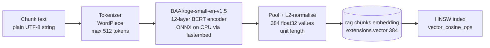
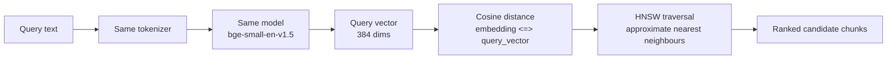
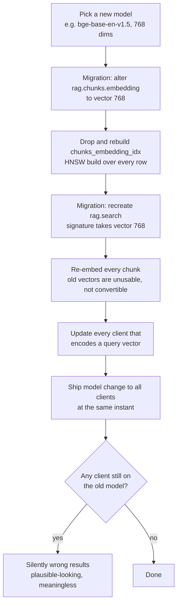

# Vectorization and embeddings

Semantic search works by turning text into a point in a high-dimensional space
such that texts about the same thing land near each other. "Near" then has a
precise arithmetic meaning, and finding related notes becomes a geometry problem
instead of a string-matching problem.

This document covers how that happens here, the exact numbers involved, and what
it would cost to change them.

---

## The flow

The query side runs the identical path, and that symmetry is not optional:

A vector is only comparable to vectors from the same model. Embed documents with
one model and queries with another and the distances are arithmetically valid but
semantically meaningless — the results look plausible and are noise. The model
identity is effectively part of the schema, which is why it is recorded in a
column comment on `rag.chunks.embedding`.

---

## The exact numbers

| Property | Value |
| --- | --- |
| Model | `BAAI/bge-small-en-v1.5` |
| Runtime | `fastembed`, ONNX, CPU, local |
| Dimensions | **384** |
| Column type | `extensions.vector(384)` |
| Max input | 512 tokens per chunk |
| Distance metric | **cosine**, pgvector operator `<=>` |
| Index | HNSW, `vector_cosine_ops` |
| Storage per vector | 384 × 4 bytes = **1,536 bytes** |
| API key required | none |
| Cost per embedding | zero |

Cosine distance measures the angle between two vectors and ignores their
magnitude. That is the right choice for text: a long note and a short note about
the same subject should be neighbours, and magnitude in an embedding space
correlates loosely with length. bge models are trained with a cosine objective
and emit L2-normalised vectors, so cosine is also simply the metric the model was
built for. Using L2 distance on normalised vectors would rank identically but
would contradict the model card for no benefit.

The index must match the metric. `vector_cosine_ops` builds an HNSW graph whose
edges reflect cosine distance; had it been built with `vector_l2_ops` while
queries used `<=>`, Postgres would ignore the index and fall back to a sequential
scan over every chunk — correct results, quietly terrible performance.

---

## Why local embeddings instead of an API model

The alternative was an embedding endpoint from a hosted provider.

| | Local `fastembed` | Hosted API |
| --- | --- | --- |
| Cost | Zero | Per-token, forever, including every re-index |
| Key management | None | Another secret to store and rotate |
| Privacy | Notes and agent history never leave the machine | Every note is sent to a third party |
| Works offline | Yes | No |
| Backfill of 443 documents | Free, minutes of CPU | A bill and a rate limit |
| Quality ceiling | Lower | Higher |
| Latency per query | Tens of ms on CPU | Network round trip |

Two of those rows decided it. The corpus is a personal knowledge vault and six
months of engineering history — content that should not be shipped to a third
party as a matter of course. And re-indexing is not a one-time event: every
chunking change, every model experiment, every schema rebuild re-embeds the whole
corpus. A pipeline that is free to re-run gets re-run and stays correct; a
pipeline that costs money per run gets avoided and drifts.

The honest trade-off is quality. A 33M-parameter model is not a frontier
embedding model, and on hard semantic queries it will retrieve worse than a large
hosted one. Two things blunt that: retrieval here is hybrid, so full-text search
covers exactly the cases dense retrieval fumbles — proper nouns, identifiers,
rare terms — and the consumer is an agent that reads the retrieved chunks and
judges them, not a UI presenting a single top answer as truth.

---

## Why 384 dimensions

384 is not a tuning knob. It is the output width of the chosen model — `bge-
small-en-v1.5` has a 384-dimensional hidden size, and its embeddings are that
wide by construction. Choosing the dimensionality means choosing the model.

The relevant comparison at model-selection time:

| Model class | Dims | Bytes/vector | Notes |
| --- | ---: | ---: | --- |
| `bge-small-en-v1.5` | 384 | 1,536 | ~33M params, ~130 MB on disk, fast on CPU |
| `bge-base-en-v1.5` | 768 | 3,072 | ~110M params, roughly 2× the storage and index memory |
| `bge-large-en-v1.5` | 1024 | 4,096 | ~335M params, noticeably slow on CPU |
| Typical hosted models | 1536–3072 | 6,144–12,288 | Best quality, per-token cost, data leaves the machine |

What 384 buys, concretely:

- **Storage.** At 1,536 bytes per vector, 100,000 chunks is about 154 MB of
  vector data. The same corpus at 1536 dims is roughly 614 MB. On a shared
  free-tier project that difference is the whole argument.
- **Index memory.** HNSW keeps its graph in memory during build and wants it in
  cache during search. Memory scales with dimensionality, and this database is
  co-tenant with a live application whose working set also needs the cache.
- **CPU speed.** Distance computations are linear in dimensionality, and so is
  encoding time. A small model on CPU keeps query latency in the tens of
  milliseconds without a GPU.
- **Headroom.** pgvector's `vector` type indexes up to 2,000 dimensions with
  HNSW. 384 leaves enormous room; a 3072-dim hosted model would not fit this
  index type at all without halving precision or reducing dimensions.

Where it falls short: fewer dimensions means less capacity to separate
fine-grained distinctions, and 512 tokens is a real ceiling on chunk size — long
passages must be split, which fragments context across rows.

---

## What changing dimensionality would cost

Not a config edit. A migration plus a full re-index.

Step by step:

1. **Column type.** `vector(384)` is a fixed-width type. Widening it rewrites the
   table.
2. **Index rebuild.** The HNSW graph is dimension-specific and must be built from
   scratch — the expensive part on a large corpus.
3. **Function signature.** `rag.search()` declares
   `query_embedding extensions.vector(384)`. A different width means a new
   function definition, and Postgres will reject the old call shape.
4. **Full re-embed.** Old vectors cannot be converted. Every chunk goes back
   through the model. This is why free local embedding matters — the operation is
   CPU time rather than a bill.
5. **Lockstep client rollout.** This is the dangerous step. During any window
   where one client encodes queries with the old model and the database holds
   vectors from the new one, queries return results. They are just wrong, in a
   way that looks entirely normal.

For a corpus this size that is an afternoon, not a rewrite — but it is
deliberately front-loaded work, which is why the model was chosen once, up front,
rather than left as something to revisit casually.
