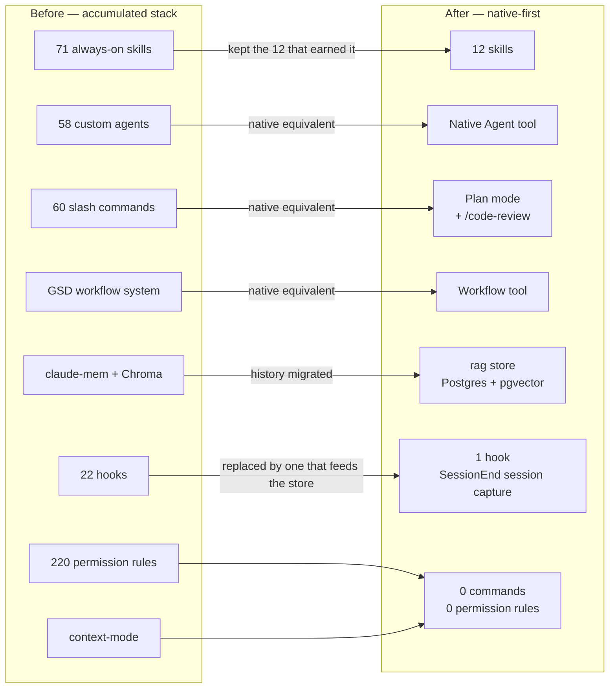

# The harness reset

A "harness" here means everything configured around Claude Code on this machine:
skills, subagent definitions, slash commands, hooks, permission rules, and the
plugins that supply them. It is the difference between a stock CLI and a tuned
working environment.

Over roughly six months this one accumulated a large amount of configuration.
Phase 2 of this project deleted most of it. This document records what was there,
what replaced it, and why the deletion was the right call.

---

## Before and after

| Component | Before | After | Reduction |
| --- | ---: | ---: | ---: |
| Always-on skills | 71 | 12 | −83% |
| Custom agents | 58 | 0 | −100% |
| Slash commands | 60 | 0 | −100% |
| Hooks | 22 | 1 | −95% |
| Permission rules | 220 | 0 | −100% |

Nothing was thrown away unrecoverably. Phase 0 archived the entire configuration
first: **839 files, 210 MB**, at `~/.claude-archive/2026-09-09/`. The reset was
reversible at every point.

---

## Why any of this was a problem

Configuration is not free. Every always-on skill is text loaded into the context
window before the first useful token of the actual task. Seventy-one of them is
a meaningful fraction of the budget spent on instructions that mostly do not
apply to the task at hand.

The failure modes that had actually shown up:

- **Context tax.** Skills that auto-load consume budget whether or not they are
  relevant. With 71 loaded, a large fraction of every session's opening context
  described capabilities that would go unused.
- **Duplicated capability.** Many custom agents and commands predated native
  features. A hand-rolled planning command competes with plan mode; a custom
  subagent definition competes with the native Agent tool. When both exist,
  which one fires is a coin toss.
- **Silent breakage.** Hooks and plugin-supplied commands break when the plugin
  updates. One documented case: a plugin's cached hooks needed a manual patch
  that reverted on every plugin update, resurfacing as a Python import error.
  Configuration that requires re-patching is configuration that is broken most
  of the time.
- **Permission rules as accumulated sediment.** 220 rules added one prompt at a
  time. Nobody could say what the effective policy was, which makes it useless
  as a safety mechanism — an allowlist you cannot read is not a control.
- **A memory system with a leak.** claude-mem's durable store was SQLite; the
  Chroma vector layer on top leaked orphan process chains on worker restart,
  which then held file locks. The valuable part was the data, not the machinery.

The common thread: this was configuration written when the tool lacked features
it now has, kept because deleting things feels risky.

---

## The replacement principle: native-first

The rebuilt harness starts from a simple rule — **if Claude Code does it
natively, do not configure a substitute.**

| Old custom thing | Native replacement |
| --- | --- |
| GSD planning commands | Plan mode |
| 58 subagent definitions | The Agent tool, with agent types defined where needed |
| Custom review commands | `/code-review` |
| Multi-step orchestration commands | The Workflow tool |
| Hook-driven context trimming | Subagents, which isolate their own context by construction |
| claude-mem's capture hooks | One `SessionEnd` hook that writes the session to the vault as markdown — see [ingestion.md](./ingestion.md#session-capture-the-hook-that-feeds-the-vault) |
| claude-mem recall | `rag.search()` through an MCP server — this repo |

The 12 surviving skills are the ones that carry knowledge the tool genuinely
does not have: domain specifics, house conventions, project-particular workflow.
That is what a skill is for. It is not a place to reimplement a built-in.

---

## What the memory migration preserved

Retiring claude-mem meant retiring the daemon, not the history. Phase 1 exported
everything to JSON before anything was deleted:

| Export | Rows | Notes |
| --- | ---: | --- |
| `observations.json` | 461 | 443 ingestible — see below |
| `session_summaries.json` | 141 | |
| `sdk_sessions.json` | 103 | Session metadata |
| `user_prompts.json` | 725 | |
| `claude-mem-snapshot.db` | 56 MB | SQLite source, `integrity_check: ok` |

Coverage runs 2026-03-24 to 2026-09-09 across four projects (`ai-news-agent`
251, `estac` 103, `quant-edge-tracker` 79, `claude-mem` 28).

Eighteen observations (ids 68–164, all timestamped between 06:09 and 08:27 on
2026-05-07) have no narrative, no text and no title. They are failed writes from
that day's data-directory migration — real rows, zero content. Ingestion skips
them, which is why the ingestible count is 443 rather than 461. Details in
[ingestion.md](./ingestion.md).

---

## What this cost

Honesty about the downside:

- **Muscle memory is gone.** Sixty slash commands were sixty things that could be
  typed without thinking. Those invocations now have to be described in prose.
- **Some deleted config was probably good.** With 220 permission rules, a few
  were surely well-judged. They went anyway, because auditing 220 rules costs
  more than re-adding the handful that turn out to matter.
- **There was a trough.** Between retiring claude-mem and the first full ingest
  there was no cross-session recall at all. It lasted one day; the store now
  holds the full history plus every session captured since.

The archive exists precisely because some of these calls may prove wrong. Any
individual piece can be restored from `~/.claude-archive/2026-09-09/`.
