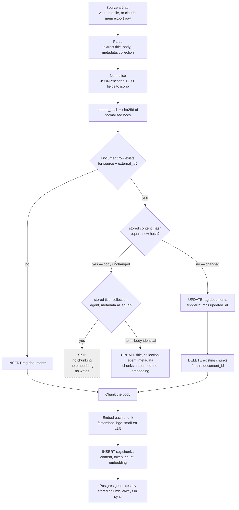

# The ingestion pipeline

> **Status: live.** `ingest/` has loaded the full claude-mem export and the
> vault into `harness-memory`: 1,324 documents and 2,360 chunks across 27
> collections as of 2026-09-15 (before short prompts and SDK worker sessions were
> pruned on 2026-09-21). Tests run with `uv run pytest`.

Ingestion turns source artifacts into rows the retrieval function can rank. It
runs as a batch job, not a service — you point it at a source and it reconciles
the database with what is on disk. It runs three ways: by hand, one note at a
time from the session-capture hook, and nightly from Task Scheduler.

```bash
cd C:/Users/estac/agentic-harness/ingest
uv run ingest --source claude-mem --path C:/Users/estac/.claude-archive/2026-09-09/claude-mem-export   # one-time import
uv run ingest --source obsidian   --path "C:/Users/estac/OneDrive - Syracuse University/vault"      # re-run any time; unchanged notes cost nothing
uv run ingest --source obsidian   --path "<vault>" --only projects/bb2dash/sessions/<id>.md         # named notes, what the hook runs (repeatable)
uv run ingest sweep-concluded     --path "<vault>" --dry-run                                        # conclude stale sessions
uv run ingest --health                                                                              # is the nightly reconcile still running?
```

---

## The pipeline



---

## The `content_hash` short-circuit

The expensive step is embedding. Everything before it is cheap file and JSON
work; everything after it is a handful of inserts. So the pipeline decides as
early as possible whether the expensive step is needed at all.

`rag.documents.content_hash` is a SHA-256 of the normalised body, stored at write
time and indexed. On every run:

1. Look up the document by `(source, external_id)` — the unique constraint that
   makes this a single index probe. The probe also returns the stored `title`
   and `metadata`.
2. If the stored hash equals the freshly computed hash, the chunks in the
   database are already correct, because they were derived from exactly these
   bytes. Nothing is re-chunked and nothing is re-embedded. What still gets
   compared is the frontmatter — see below.
3. Otherwise re-chunk and re-embed.

### Frontmatter-only changes

The hash is over the **body**, and several things change a note's frontmatter
and nothing else: a resume flipping `status` to `superseded`, a `child_sessions`
link added when a subagent stops after its parent, and `sweep-concluded --apply`
writing `status` and `concluded_at`. All of them used to land behind the
unchanged short-circuit, so `rag.documents.metadata` stayed as it was until the
body happened to change — which for a concluded session is never.

So when the body hash matches, every column the upsert writes apart from the
body and its hash — `title`, `collection`, `agent`, `metadata` — is compared
with the freshly parsed value (`metadata` as canonical JSON with sorted keys,
because `jsonb` does not preserve the loader's order). If any differ, the
document takes the **metadata-only path**: one

```sql
UPDATE rag.documents
SET title = %s, collection = %s, agent = %s, metadata = %s::jsonb
WHERE id = %s
```

`collection` is in there for a reason. A note with a stable frontmatter `id:`
that moves from `projects/foo/` to `projects/bar/` keeps its body, so this is
the only statement that would ever correct it — and `filter_collection` matches
with `=`, so a stale collection is invisible: the note quietly stops coming back
for its new project and keeps coming back for its old one.

and nothing else. No chunk is deleted, no chunk is inserted, and the embedder is
never called — the vectors were derived from a body that did not change, so
recomputing them would produce the same numbers. The run reports it as its own
action:

```
--- ingest complete ---
    2  metadata-updated
   14  unchanged
  chunks written: 0
  refreshed title/metadata on 2 document(s) whose body was unchanged: no re-chunking, no embedding
```

`--dry-run` reports the same documents as `would-update-metadata` and writes
nothing. `--force` skips the comparison entirely and takes the full re-embed
path, as it does for every other document.

Widening `content_hash` to cover frontmatter would be the other way to catch
this, and would re-embed all 1,324 documents in the store the first time it ran,
for no change in what any of them mean.

One cost worth knowing: `metadata._ingest` carries the file's `modified_at` and
`bytes`, so rewriting a note with identical frontmatter still counts as a
metadata change. That is one UPDATE — no model work — and it keeps the stored
metadata honest about the file on disk.

Why this matters in practice: an Obsidian vault re-scan touches every note, but a
typical editing session changes two or three of them. Without the hash check,
every run pays the full embedding cost of the entire vault. With it, an unchanged
vault costs one indexed lookup per file and zero model invocations. It is also
what makes the session-capture hook cheap to pair with: re-running ingest after
every session only embeds the one new note.

Hashing the **document**, not the chunk, is the deliberate choice. Chunk-level
hashing would let an edit to paragraph one leave paragraphs two through ten
untouched — but chunk boundaries shift when text is inserted, so in practice
almost every chunk changes anyway, and the bookkeeping to detect the rare case
costs more than it saves. Document-level hashing is coarser and much simpler:
either the file changed or it did not.

The re-embed path deletes chunks before reinserting them rather than updating in
place. A shorter revision produces fewer chunks, and updating in place would
leave the tail of the old version behind as orphan vectors that still match
queries. Delete-then-insert cannot leave stale rows.

---

## Idempotency

Running ingestion twice must not double the data. Three constraints enforce that
at the database level, not by convention:

| Constraint | What it prevents |
| --- | --- |
| `unique (source, external_id)` on `documents` | The same note becoming two documents |
| `unique (document_id, chunk_index)` on `chunks` | Chunk 3 of a document existing twice |
| `on delete cascade` from chunks to documents | Orphan chunks surviving a deleted document |

A crashed run is safe to re-run. Documents already written keep their hash and
are skipped; the document that was mid-flight either has no chunks yet or has
them all, and either way the next run reconciles it.

This was tested the hard way: the first full ingest died at document 276 when
the Supabase pooler reaped a connection held open across a long embedding run,
failing the remaining 1,029. The store now reconnects and retries with TCP
keepalives, and the re-run picked up exactly where the hashes said it should.

---

## Named-note runs: `--only`

```bash
uv run ingest --source obsidian --path "<vault>" --only projects/bb2dash/sessions/<id>.md

# repeatable: every note the capture hook touched, in one process
uv run ingest --source obsidian --path "<vault>" \
    --only projects/bb2dash/sessions/<id>.md \
    --only projects/bb2dash/sessions/<id>--<agent>.md
```

A full vault walk reads every note to find the two that changed. That is cheap
enough nightly and far too slow to hang off the end of a session, so `--only`
runs the *same* pipeline over just the notes it names. The path may be absolute
or vault-relative; a relative one resolves against the vault, never against the
process's working directory, because the caller is a background process started
from wherever the session happened to be.

**The flag is repeatable, and one run means one process.** A `SessionEnd` often
writes more than one note — a resume rewrites the note it supersedes, a
`SubagentStop` rewrites its parent's `child_sessions` — and each ingest process
loads the 130 MB embedding model, so three notes in three processes would pay
that three times. The same path named twice is loaded once; two notes claiming
the same frontmatter `id:` are refused exactly as in a full walk.

Four things are refused rather than tolerated, because nobody is watching this
run's stdout:

| Refused | Why |
| --- | --- |
| A note that is not inside `--path` | The vault boundary is the whole security model of the flag. `..` and symlinks are resolved before the check. |
| A missing file | A typo'd path that "succeeded" having done nothing is the worst possible outcome for a background job. |
| A path the full walk skips (`templates/`, `.obsidian/`) | It would create a row the next `--prune` sweep immediately deletes. |
| `--only` together with `--prune` | The orphan sweep deletes everything the run did not produce. After a named-note run, that is the entire vault. |

`ingest: false` and an empty body are **not** errors. They come back as skips
with the same wording a full walk would use, and the run exits 0.

One bad path fails the whole run rather than ingesting the rest quietly. The
enqueue in the hook already drops a path it cannot justify before spawning, so a
bad one reaching here is a defect worth seeing in the log.

Re-running `--only` on a note that has not changed performs **zero embeddings**:
it is one hash, one indexed lookup by `(source, external_id)`, and a decision to
stop. What it does not avoid is loading the tokenizer, because the chunker asks
for the model's own WordPiece counter when it is built — so an unchanged note
costs a model load and no inference. That is the difference between a second and
a minute, which is why this is fine behind a detached spawn and would not be
fine inside the hook.

A `--only` run never refreshes the health timestamp. It reconciled the notes it
was given, not the vault, and health means "the nightly reconcile is still
happening".

---

## Source 1 — claude-mem history

Exported in Phase 1 to
`C:/Users/estac/.claude-archive/2026-09-09/claude-mem-export/`. This is a
one-time historical import; claude-mem is retired and produces no new rows.

| File | Rows | Ingested | `external_id` | Body |
| --- | ---: | ---: | --- | --- |
| `observations.json` | 461 | **443** | bare observation id | `narrative` |
| `session_summaries.json` | 141 | **137** | `summary:<id>` | labelled concat of `request`, `investigated`, `learned`, `completed`, `next_steps`, `notes` |
| `user_prompts.json` | 725 | **725** | `prompt:<id>` | `prompt_text` |
| `sdk_sessions.json` | 103 | 0 | — | pure session metadata; used only to enrich the other three |

All three carry `source='claude-mem'` and `agent='claude-code'`. The
`external_id` prefixes keep the three from colliding inside one source. Their
`project` field became `collection` verbatim — which is why the live collection
names are lowercase and some contain spaces.

Three things about this data determined how it is parsed:

**`facts`, `concepts`, `files_read` and `files_modified` are JSON-encoded TEXT,
not arrays.** Writing them straight into a `jsonb` column would store a JSON
*string* whose content happens to look like an array — every subsequent `jsonb`
path query against it would silently return nothing. They are parsed, then
stored. All 461 rows parse cleanly.

**`narrative` is the body to embed.** There is also a legacy `text` column that
is NULL on every modern row; reading it as a fallback would produce empty
documents for almost everything.

**Empty rows are skipped explicitly.** Eighteen observations (ids 68–164, all
timestamped between 06:09 and 08:27 on 2026-05-07) and four session summaries
have no content at all — failed writes from that day's data-directory migration.
`body` is `NOT NULL`, so ingesting them would fail anyway; skipping is the
explicit version of the same outcome.

**Session enrichment needs two join keys, not one.** `user_prompts` has no
`memory_session_id`; it joins on `content_session_id`. Only 18 of the 103
`sdk_sessions` rows carry a `memory_session_id`, while `content_session_id` is
unique across all 103. The enrichment index keys on both.

---

## Source 2 — the Obsidian vault

`C:/Users/estac/OneDrive - Syracuse University/vault/`. Plain markdown on
OneDrive syncs cleanly; **binary indexes must never live there** — that
combination has previously caused file-lock failures on this machine, which is
one of the reasons the vector index is in Postgres and the git repo lives outside
OneDrive.

### The folder is the collection

```
vault/
  projects/
    agentic-harness/     index.md  sessions/  notes/  decisions/
    bb2dash/             sessions/
    ev-trainer/          index.md  sessions/  notes/  decisions/
    quant-edge-tracker/  index.md  sessions/  notes/  decisions/
    misc/                index.md  sessions/  notes/  decisions/
  classes/
    ist323/  ist352/  ist466/  ist471/  ecn304/  geo103/     (Fall 2026)
                         index.md  sessions/  notes/  materials/
    ist335/              index.md  sessions/  notes/
  daily/                 one note per day, from templates/daily.md
  templates/             skipped by the loader
  .obsidian/             skipped by the loader
```

The second path segment (`agentic-harness`, `ist335`) becomes
`documents.collection` **verbatim**. Folder casing is collection casing, and
`filter_collection` matches with `=`, so keep new folders lowercase-hyphenated.
Class folders are the lowercase form of the bb2dash course ids (`IST.323` →
`ist323`; both `GEO.103.*` sections → `geo103`).

A project folder is a **repository**, not a checkout. `bb2dash-wt-sl` was a
worktree of `emstacho-su/bb2dash` and `bb2dash-retrieval` an earlier checkout of
the same repository; both had grown their own folder, splitting one project's
history three ways. They are gone, and the session-capture hook now resolves the
collection from the git remote so they cannot come back.

Every project and class folder carries an `index.md` whose frontmatter has a
UUID `id:`, a `title:` and the `collection:`, so a rename never strands a row.
Class indexes also record `term:` and the exact `bb2dash_course:` id(s).

### Opting out: `ingest: false`

A note with `ingest: false` in its frontmatter stays in the vault for reading
and linking but is never embedded. The loader reports it as a skip with the
reason `frontmatter ingest: false`; it is never hidden. YAML's own `false`,
`no` and `off` work, as do the quoted string `'false'` and bare `0`. A
structurally wrong value (a list, a mapping, an empty string) is refused with an
error rather than guessed at. The vault-root `templates/` folder is excluded
outright, like `.obsidian/`, because a template is `{{date}}` placeholders
rather than content; a `templates/` folder deeper inside a project is ordinary
content.

**Opting out is not a delete.** Adding `ingest: false` to a note that was
already embedded stops future updates but leaves its existing rows searchable.
Remove them with the guarded `--prune` orphan sweep (below), which treats an
opted-out note the same as a deleted one.

### Class materials from bb2dash

```bash
cd ingest
uv run export-materials --env-file C:/Users/estac/projects/bb2dash/.env \
    --vault "C:/Users/estac/OneDrive - Syracuse University/vault" [--dry-run] [--course IST.323]
```

The exporter reads `bb_files` + `bb_file_text` from the **bb2dash** project over
PostgREST (its `public` schema is exposed; the service role is required because
the corpus tables carry insert-only anon policies) and writes one note per file
to `classes/<course>/materials/<slug>-<bb_files.id>.md`. The id is always in
the filename so a note's path is a pure function of its row: it never moves
when a same-named sibling appears or is superseded, which keeps re-runs
idempotent and prevents two notes ever sharing an `id:`.

| Frontmatter | Value |
| --- | --- |
| `id` | `bb2dash-file-<bb_files.id>` — stable across renames |
| `collection` | lowercase course folder |
| `type` / `source` | `material` / `bb2dash` |
| `ingest` | **`false`**, always |
| `course`, `bucket`, `week`, `bb_path`, `sha256`, `captured_at` | copied from `bb_files` |

The body is one `## Slide N` / `## Page N` / `## Document` section per text
unit, in unit order, with speaker-note `[notes]` markers left verbatim. Files
that are superseded, not extracted (`text_status ≠ extracted`), have no text
units, have no course id yet (the classifier fills `course_id` in after
capture), or carry a course id the folder rule cannot map are reported as skips —
one odd row never aborts the export. `--course` must be an exact bb2dash id and
must match at least one file; an empty match is an error, not a quiet no-op.
Writes are idempotent: a note is rewritten only when its content differs, and
the report says created / updated / unchanged.

Why `ingest: false` is mandatory here: bb2dash embeds with **gte-small** and
harness-memory with **bge-small-en-v1.5**. Both are 384-dim, so embedding the
same text into both would raise no error — it would just rank confidently
wrong. Materials are *read* in the vault and *searched* through the `bb2dash`
MCP server. The exporter refuses any `SUPABASE_URL` that is not `https://` or whose host is
not the bb2dash project and reads the bb2dash `.env` directly instead of loading it
into the process environment, so the harness `.env` can never be picked up by
mistake. It only ever reads from bb2dash.

Mapping:

| Column | Value |
| --- | --- |
| `source` | `'obsidian'` |
| `external_id` | frontmatter `id:` when present, else the vault-relative path |
| `collection` | second path segment |
| `title` | frontmatter title, or filename stem |
| `body` | note markdown |
| `metadata` | frontmatter, tags, mtime |

### Reconciliation policy

Prefer an `id:` in frontmatter. With a path-based key, renaming a note strands
its old row and creates a duplicate, because a rename is indistinguishable from
delete-plus-create. The session-capture hook writes a stable
`id: session-<session-id>` for exactly this reason.

An orphan sweep — deleting `source='obsidian'` documents whose `external_id` was
not seen in the walk — exists behind an explicit `--prune` flag, **off by
default**. Otherwise a partial or interrupted run would silently mass-delete.

---

## Session capture: the hook that feeds the vault

This is the capability claude-mem used to provide and nothing else replaced. A
Claude Code `SessionEnd` hook runs when a session ends and turns its transcript
into one note. The source lives in [`hooks/`](../hooks/README.md); `node
hooks/install.mjs` deploys a byte-identical copy to `~/.claude/hooks/`, which is
the path `~/.claude/settings.json` registers.

1. Reads the session's JSONL transcript from `~/.claude/projects/<sanitised-cwd>/`,
   plus its subagent transcripts, within a byte and time budget.
2. Resolves the collection: a class folder under `vault/classes/`, else the git
   remote of the cwd — through a worktree to its main repository — else the
   folder name, flagged `collection_source: folder`.
3. Writes **one note per session**,
   `vault/<projects|classes>/<collection>/sessions/<session_id>.md`, named by the
   full session id and rewritten on every `SessionEnd`.
4. Copies only user prompts, tool *inputs* and the session's closing assistant
   message (`## Outcome`, verbatim, capped), all run through redaction (env
   assignments, connection-string passwords, JWTs, vendor key formats). Raw tool
   output is never copied, with two narrow exceptions that keep one capture group
   each: a pull request number from `gh pr` output and an artifact URL.

Design rules, in priority order: never block session exit (a 1.2 s internal
deadline inside SessionEnd's ~1.5 s budget, with the elapsed milliseconds logged
every run); never fail loudly (every path exits 0); never write a credential;
never write an empty note.

**Verified firing for real on 2026-09-09**, not just under a hand-fed payload:
the log recorded a 121 ms write on session end, the note appeared in
`projects/agentic-harness/sessions/`, and the next ingest run embedded it as the
store's first `source='obsidian'` document.

### Frontmatter: schema v2

`schema_version: 2`. Every field below is present on every note. A field that
could not be derived is an **empty string or an empty list** — never absent and
never guessed, so "unknown" and "not applicable" stay distinguishable and each
field keeps one type for metadata filtering.

| Field | Value |
| --- | --- |
| `id` | `session-<session_id>` — the `external_id` ingest keys on, stable for the note's life |
| `collection`, `collection_source` | the repository slug, and whether it came from `git` or a `folder` |
| `status` | `active` → `concluded` → `superseded`; ratchets one way |
| `concluded_at` | set when the session ends for a reason other than a resume |
| `supersedes`, `resumed_from` | the resume chain, holding note ids |
| `repo`, `branch`, `worktree`, `repos_touched` | git identity; `repos_touched` is how a cross-repo session stays one note |
| `commits`, `prs` | commits in the session's window; PR numbers as **integers** |
| `phase`, `tags` | `phase-<n>` and the controlled vocabulary in [tags.md](./tags.md) |
| `parent_session`, `child_sessions` | the spawning session, and the agent transcripts this one spawned |
| `memory_files`, `plan_file`, `docs_touched`, `artifacts` | lifted out of the touched-file list |
| `files_modified` | repo-relative, with scratchpad, transcript and `node_modules` paths dropped |
| `prompt_count`, `command_count`, `duration_minutes`, `tools_used` | volume |

The v1 fields (`title`, `type`, `session_id`, `date`, `started_at`, `ended_at`,
`cwd`, `cwds_seen`, `end_reason`, `agent`, `generator`) are unchanged.

### Subagent capture

A `SubagentStop` hook, the same entry point, writes one note per worker at
`sessions/<session_id>--<agent_id>.md` with `parent_session` set to the session
that spawned it and `agent_type` recording what kind of worker it was. The
parent's `child_sessions` holds the child note ids, so a search follows the link
in either direction: back from a worker by `parent_session`, forward from a
session by `child_sessions`.

The list is complete whichever order the events arrive in. A worker usually
stops long before its parent, and the parent's `SessionEnd` back-fills
`child_sessions` from the `subagents/` directory; a worker that stops after the
parent was captured merges itself into the existing note.

### One note per session, and what "merge" means

The filename is the full `session_id`, never the date: a resumed session changes
its date, and a date-keyed filename would strand the row already in the store.

Stack edits these notes by hand, so a rewrite is a **merge**:

- lists grow — a tag, commit or PR in the note stays in the note;
- scalars only improve — a derived value replaces an empty one, never the
  reverse;
- `status` never regresses, and a stale `SessionEnd` replayed over a concluded
  note writes nothing at all;
- a note whose frontmatter will not parse is left alone rather than overwritten;
- anything written **below the generated marker line** at the end of the body is
  kept verbatim, so a paragraph of context typed into a note survives every
  later capture.

A resume that arrives after the note concluded starts a new `<id>-r2.md` naming
what it continues in `resumed_from` and `supersedes`, and flips the earlier note
to `superseded`. Nothing is deleted and no id ever changes meaning.

`content_hash` is computed over the **body**, so a change confined to
frontmatter does not change the hash. The pipeline compares the stored `title`
and `metadata` against the parsed ones in that case and issues a metadata-only
UPDATE — see [Frontmatter-only changes](#frontmatter-only-changes). The fields
that matter for retrieval are *also* mirrored into the note's `## Session facts`
table, so they are searchable as text as well as filterable as metadata.

### Tags

[`docs/tags.md`](./tags.md) is the controlled vocabulary, mirrored into the
vault's `templates/` folder. At most five hook-applied tags; tags added by hand
are uncapped and never removed. A session the classifier cannot place gets
exactly `tags: [unclassified]` and appears in the weekly review list:

```bash
node hooks/untagged-sessions.mjs --vault "C:/Users/estac/OneDrive - Syracuse University/vault"
```

### The one-time migration

Notes written by hook 1.0.0 were filed by folder, named `<date>-<id8>.md` and
carried no git context. `node hooks/migrate-sessions.mjs` moved all seven to
`<session_id>.md` in the collection their recorded `cwd` resolves to, rewrote
them as schema v2, and back-filled `branch`, `commits`, `prs` and `phase` from
`git log` over each session's window plus `gh pr list --state all`. Fields that
could not be derived were left empty.

`bb2dash-retrieval` and `bb2dash-wt-sl` were emptied and removed. Neither
checkout exists on disk any more, so an explicit table in `hooks/lib/migrate.mjs`
maps them to `bb2dash`; nothing is inferred from a folder name.

### Ingest on capture

Writing the note is not the end of it. Until the note is embedded, `rag` cannot
answer anything about the session that just happened, and before this the note
waited for whenever somebody next ran `ingest` by hand.

So the hook, immediately after a successful write, calls
`hooks/lib/enqueue-ingest.mjs`, which **starts** a single-note ingest and
returns:

```
SessionEnd
  └─ session-capture.mjs writes vault/projects/<c>/sessions/<id>.md
       └─ enqueueIngest()                                   9-16 ms
            └─ detached: uv --directory <project> run ingest
                          --source obsidian --path <vault>
                          --only <note> [--only <note> ...]
                 └─ stdout + stderr -> ~/.claude/hooks/ingest-on-capture.log
```

The child is spawned `detached` and `unref()`ed, with its output going to a file
rather than a pipe — an unread pipe buffer would tie the parent's lifetime back
to the child and undo the whole point. The note path is passed as one element of
an argument array with `shell: false`, never interpolated into a command string.
`uv` is resolved to an absolute path *that exists* (or the enqueue refuses), and
the project is passed with `uv --directory` rather than a spawn `cwd`, because
Windows resolves a bare command name against the child's working directory
before `PATH`. The module cannot throw; every refusal returns a reason and
writes it to `session-capture.log`. Like every other optional step it is behind
the hook's deadline check: a session already over budget logs
`ingest-enqueue skipped: over budget` and leaves the note to the nightly run.

**Every note the capture touched goes to one child.** A capture rarely changes
one file: a resume rewrites the note it supersedes (`status: superseded`) and a
`SubagentStop` rewrites its parent's `child_sessions`, both frontmatter-only
edits that nothing else would carry into the store. The capture returns
`touchedPaths`, and `--only` is repeatable, so they are embedded by one process
rather than one process per note — each one loads the 130 MB model.

**A note that re-rendered byte-identically is not enqueued at all.** The write
is skipped, `touchedPaths` comes back empty and the log says
`no note changed on disk`. This matters because `SubagentStop` fires at every
stop point of a multi-turn worker rather than once at the end — nine firings for
one worker is ordinary — and without the check each one paid for a full ingest
process to re-confirm a hash. When the worker's transcript *has* grown the note
genuinely differs and the ingest still runs.

What this does not solve: N workers stopping at the same moment still means N
detached processes, each loading its own copy of the model. The batching is
within one hook invocation, not across concurrent ones.

The log line says `spawn requested`, not `started`, because that is all the hook
can know: a child that fails to start reports it through an asynchronous `error`
event and the hook calls `process.exit(0)` before the next tick. The one
synchronous failure it can see is a spawn that returns no `pid`, which is logged
as such.

```
2026-09-15T14:38:02.114Z ingest-enqueue spawn requested for projects/agentic-harness/sessions/2026-09-10-92056c02.md (pid=48120)
```

| Variable | Default | Purpose |
| --- | --- | --- |
| `HARNESS_INGEST_ON_CAPTURE` | on | `0` / `false` / `off` / `no` disables the enqueue |
| `HARNESS_INGEST_PROJECT` | `~/agentic-harness/ingest` | Which uv project runs `ingest` |
| `HARNESS_UV_BIN` | `~/.local/bin/uv.exe`, else the first `uv` on `PATH` | The `uv` executable; never a bare name |
| `HARNESS_INGEST_LOG` | `~/.claude/hooks/ingest-on-capture.log` | Where the detached run's output lands |

The default project directory is the **main checkout**, never a worktree: a
worktree is deleted when its branch merges, and a hook pointing into a deleted
one fails quietly. The child inherits `HARNESS_INGEST_ON_CAPTURE=0`, so an
ingest can never enqueue another ingest.

Measured cost of the enqueue itself: **9–16 ms** warm. The first spawn after a
reboot cost 2.8 s while Windows validated `uv.exe`, which is charged to the
caller — so the first session ended after a reboot can exit noticeably slower.
Turning the kill switch off leaves the nightly reconcile to pick the note up.

Full detail is in [../hooks/README.md](../hooks/README.md).

---

## The nightly reconcile

The per-note run covers the common case. The nightly job covers everything it
missed — a session ended while OneDrive was offline, a note edited by hand, a
machine that was asleep — and it is the only thing that concludes stale
sessions.

```powershell
./scripts/register-nightly-ingest.ps1                       # idempotent; -Force replaces
./scripts/register-nightly-ingest.ps1 -At 02:30 -SweepMode DryRun
./scripts/register-nightly-ingest.ps1 -Unregister
```

That registers `AgenticHarness-NightlyIngest`, which runs
`scripts/nightly-ingest.ps1` daily. Every path is explicit — PowerShell, `uv`,
the project, the vault — because a scheduled task inherits almost none of a
login shell's environment and a bare `uv` that resolves interactively will not
resolve at 03:00. `-StartWhenAvailable` is the setting that matters on a laptop:
the machine is usually asleep at 03:00, and without it a missed run is simply
lost.

The script does three things, in this order:

0. **`node hooks/sweep-transcripts.mjs --min-idle-hours 6`** — the transcript
   sweep. Every transcript under `~/.claude/projects/` that has no note in the
   vault and has been idle six hours goes through the hook's own capture code
   and comes out as a note with `captured_by: sweep`. This is what catches the
   sessions `SessionEnd` never fires for: SDK-spawned review workers, sessions
   killed with their terminal, desktop sessions from before the hook, and cloud
   sessions pulled down with `claude --teleport`. See
   [../hooks/README.md](../hooks/README.md#the-nightly-transcript-sweep).
0b. **`node hooks/collect-checkpoints.mjs`** — the notes cloud sessions left in
   git. A cloud session has no transcript here and runs no local hook, so when
   one is worth keeping Stack runs `/checkpoint` (or `/checkpoint <course>`)
   inside it; the skill commits a schema-v2 note under `.harness/sessions/` and
   pushes. The collector fetches every branch of the tracked repositories,
   validates and redacts each note, and files it under the class or project it
   names, marked `captured_by: skill`. See
   [../hooks/README.md](../hooks/README.md#cloud-sessions-checkpoint).
   The same collector also runs on its own at 12:00 and 18:00
   (`scripts/register-checkpoint-collect.ps1`), with `--ingest`, so a daytime
   checkpoint is searchable the same afternoon.
1. **`ingest sweep-concluded --apply`** — see below.
2. **`ingest --source obsidian --path <vault>`** — a full walk, which picks up
   the notes both sweeps just wrote or edited in the same night.

A failing sweep of either kind does not abort the ingest: a missing note or a
stale status is a smaller problem than a stale index. The task's exit code is
the ingest's, so Task Scheduler's "last result" means what it looks like it
means.

### The 24 h conclude sweep

R-27.2 concludes a session when no resume has followed within 24 hours. The hook
cannot know that — it has already exited — so the sweep decides it:

```bash
uv run ingest sweep-concluded --path "<vault>" --dry-run   # the default
uv run ingest sweep-concluded --path "<vault>" --apply
```

It visits every note the vault walk visits whose frontmatter says
`type: session`, and for each one:

| Frontmatter | What happens |
| --- | --- |
| `status: active`, `ended_at` over 24 h ago | `status: concluded`, `concluded_at: <now>` |
| `status: active`, `ended_at` recent | left alone |
| `status: concluded` or `superseded` | left alone — status never regresses |
| no `status`, or an unparseable `ended_at` | **refused**, with the reason, and nothing written |

**It merges; it does not rewrite.** Exactly two keys change, and the edit is made
on the raw text line by line rather than by loading and re-dumping the YAML. Key
order, quoting style, blank lines, indentation, CRLF endings, an inline `#`
comment on the `status:` line and every tag added by hand all survive
byte-for-byte. That matters because these notes are Stack's, and a sweep that
reformatted them nightly would be worse than no sweep.

Two more rules, both learned from the same instinct — this job runs unattended
at 03:00 over files the user also edits by hand:

- **The write is atomic.** A note is written to a sibling file and renamed over
  the original, so a crash mid-write cannot leave one of Stack's notes empty.
- **A block scalar is refused, not edited.** `status: |` or `status: >` puts the
  value on the lines *below*, which a line-wise edit would strand as invalid
  YAML. Neither key is ever written that way; if one is, it was a hand edit and
  the sweep leaves it alone.

On the live vault, the seven session notes now carry the v2 schema and are all
already concluded, so the sweep correctly does nothing:

```
$ uv run ingest sweep-concluded --path "<vault>" --dry-run

--- conclude sweep: dry run, nothing written ---
  scanned 7 session note(s)
      7  left-alone
```

Before those notes gained a `status`, the same command refused all seven with
`no 'status' in frontmatter; refusing to invent one` — which is the behaviour
that matters: the sweep never guesses a lifecycle it cannot read.

### Health is staleness, not failure

A scheduled task that never fires reports nothing at all: no error, no log line,
no alert. So the check is not "did it fail" but "how long since it last worked".

A **complete** run — obsidian, not dry, no `--limit`, no `--only`, no failures —
writes `~/.claude/hooks/ingest-state.json`:

```json
{
  "schema_version": 1,
  "last_success": "2026-09-15T15:12:08.465430+00:00",
  "source": "obsidian",
  "path": "C:\Users\estac\OneDrive - Syracuse University\vault",
  "documents": 18,
  "chunks_written": 47
}
```

```bash
uv run ingest --health     # exits 1 past 36 h, 0 inside it
```

36 hours is one missed night plus margin for a laptop that was closed at 03:00.
Set `HARNESS_INGEST_STATE_FILE` to move the file. Logs for the job itself are in
`~/.claude/hooks/nightly-ingest.log`.

---

## Windows path gotcha

Native Windows binaries — `node.exe`, `sqlite3.exe`, the Python interpreter —
cannot read MSYS-style `/c/Users/...` paths. `node` silently resolves such a path
to `C:\c\Users\...` and fails with `ENOENT`, which reads like a missing file
rather than a malformed path.

- Pass `C:/Users/...` to any native binary.
- Only the bash shell itself — redirects, `ls`, `cp`, `find` — understands
  `/c/...`.
- A script that needs both should bind two separate variables rather than
  converting on the fly.

This has already broken two commands during this project.

---

## Configuration

Ingestion reads its one credential from the environment and never hardcodes it:

```
DATABASE_URL                # direct Postgres — postgresql://postgres.<ref>:<pw>@aws-0-us-east-1.pooler.supabase.com:5432/postgres
DATABASE_CA_CERT            # absolute path to certs/prod-ca.crt — connections are sslmode=verify-full, never downgraded
FASTEMBED_CACHE_DIR         # defaults to ~/.cache/fastembed; keep it out of OneDrive
HARNESS_INGEST_STATE_FILE   # defaults to ~/.claude/hooks/ingest-state.json; the nightly last-success timestamp
```

The credential is never passed on a command line and never written to a log.
`--check-env` reports which variables are set and never prints a value.

**Connect over `DATABASE_URL`, not PostgREST.** The `rag` schema is deliberately
not exposed to the REST API — a `supabase-js` RPC returns `HTTP 406 PGRST106` and
cannot reach these tables. The reasoning is in
[architecture.md](./architecture.md#why-direct-postgres-and-not-postgrest); the
part that matters for ingestion is throughput. Bulk chunk insertion over HTTP
means one round-trip per row; over a direct connection it is batched multi-row
inserts on a single session.

Connection specifics that each cost an hour — session pooler not direct host,
`postgres.<ref>` username, port 5432 not 6543, pinned CA — are in
[../db/README.md](../db/README.md#connection-specifics--each-of-these-cost-an-hour).
