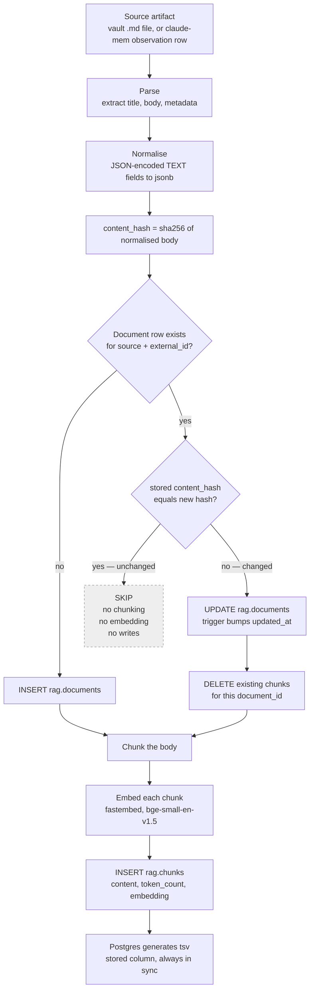

# The ingestion pipeline

> **Status: designed, in progress.** The `rag` schema and `rag.search()` are
> live; `ingest/` is being written now and has ingested nothing yet. The store
> currently holds 0 documents and 0 chunks. Everything below describes the
> intended design and the data it will read, not behaviour you can observe today.

Ingestion turns source artifacts into rows the retrieval function can rank. It
runs as a batch job, not a service — you point it at a source and it reconciles
the database with what is on disk.

---

## The pipeline



---

## The `content_hash` short-circuit

The expensive step is embedding. Everything before it is cheap file and JSON
work; everything after it is a handful of inserts. So the pipeline decides as
early as possible whether the expensive step is needed at all.

`rag.documents.content_hash` is a SHA-256 of the normalised body, stored at write
time and indexed. On every run:

1. Look up the document by `(source, external_id)` — the unique constraint that
   makes this a single index probe.
2. If the stored hash equals the freshly computed hash, **stop**. The chunks in
   the database are already correct, because they were derived from exactly these
   bytes. Nothing is re-chunked, nothing is re-embedded, no rows are written.
3. Otherwise re-chunk and re-embed.

Why this matters in practice: an Obsidian vault re-scan touches every note, but a
typical editing session changes two or three of them. Without the hash check,
every run pays the full embedding cost of the entire vault. With it, an unchanged
vault costs one indexed lookup per file and zero model invocations.

Hashing the **document**, not the chunk, is the deliberate choice. Chunk-level
hashing would let an edit to paragraph one leave paragraphs two through ten
untouched — but chunk boundaries shift when text is inserted, so in practice
almost every chunk changes anyway, and the bookkeeping to detect the rare case
costs more than it saves. Document-level hashing is coarser and much simpler:
either the file changed or it did not.

The re-embed path deletes chunks before reinserting them rather than updating in
place. A shorter revision produces fewer chunks, and updating in place would
leave the tail of the old version behind as orphan vectors that still match
queries. Delete-then-insert cannot leave stale rows.

---

## Idempotency

Running ingestion twice must not double the data. Three constraints enforce that
at the database level, not by convention:

| Constraint | What it prevents |
| --- | --- |
| `unique (source, external_id)` on `documents` | The same note becoming two documents |
| `unique (document_id, chunk_index)` on `chunks` | Chunk 3 of a document existing twice |
| `on delete cascade` from chunks to documents | Orphan chunks surviving a deleted document |

A crashed run is safe to re-run. Documents already written keep their hash and
are skipped; the document that was mid-flight either has no chunks yet or has
them all, and either way the next run reconciles it.

---

## Source 1 — claude-mem history

Exported in Phase 1 to
`C:/Users/estac/.claude-archive/2026-09-09/claude-mem-export/`.

| File | Rows | Notes |
| --- | ---: | --- |
| `observations.json` | 461 | 443 ingestible |
| `session_summaries.json` | 141 | |
| `sdk_sessions.json` | 103 | Session metadata |
| `user_prompts.json` | 725 | |
| `claude-mem-snapshot.db` | 56 MB | SQLite source, `integrity_check: ok` |

Observation columns: `id, memory_session_id, project, type, title, subtitle,
facts, narrative, concepts, files_read, files_modified, prompt_number,
discovery_tokens, created_at, created_at_epoch, content_hash`.

Three things about this data determine how it must be parsed:

**`facts`, `concepts`, `files_read` and `files_modified` are JSON-encoded TEXT,
not arrays.** They are strings containing JSON. Writing them straight into a
`jsonb` column would store a JSON *string* whose content happens to look like an
array — every subsequent `jsonb` path query against it would silently return
nothing. They must be parsed, then stored. All 461 rows parse cleanly; there is
no error branch to design around here, only a decode step not to forget.

**`narrative` is the body to embed.** It is the prose account of what happened.
There is also a legacy `text` column that is NULL on every modern row; reading it
as a fallback would produce empty documents for almost everything.

**Eighteen rows are empty.** Ids 68–164, all timestamped between 06:09 and 08:27
on 2026-05-07, have no narrative, no text and no title. They are failed writes
from that day's data-directory migration — rows that exist with nothing in them.
They are skipped, which is where 443 comes from. `body` is `NOT NULL`, so
ingesting them would fail anyway; skipping is the explicit version of the same
outcome.

Distribution, useful for sanity-checking a run:

- **Types:** change 156, discovery 113, feature 92, bugfix 38, refactor 34,
  decision 28.
- **Projects:** ai-news-agent 251, estac 103, quant-edge-tracker 79,
  claude-mem 28.
- **Range:** 2026-03-24 to 2026-09-09.

Mapping:

| Column | Value |
| --- | --- |
| `source` | `'claude-mem'` |
| `external_id` | the observation `id` |
| `agent` | `'claude-code'` |
| `title` | observation `title` |
| `body` | `narrative` |
| `metadata` | `project`, `type`, `subtitle`, parsed `facts` / `concepts` / `files_read` / `files_modified`, `created_at` |

This is a one-time historical import. claude-mem is retired and produces no new
rows.

---

## Source 2 — the Obsidian vault

**The vault does not exist yet.** The target is
`C:/Users/estac/OneDrive - Syracuse University/vault/`, and no vault is
registered — `obsidian.json` is empty. This is Phase 4 work.

Mapping:

| Column | Value |
| --- | --- |
| `source` | `'obsidian'` |
| `external_id` | vault-relative path |
| `title` | note title, or filename stem |
| `body` | note markdown |
| `metadata` | frontmatter, tags, mtime |

Using the vault-relative path as `external_id` means a renamed note is a new
document and the old one is left stranded. Reconciliation therefore needs a
delete pass — anything under `source='obsidian'` whose `external_id` no longer
exists on disk should be removed, cascading its chunks. Content-addressed
identity would avoid that, but it would also break every wikilink between notes.

Markdown on OneDrive is fine and syncs cleanly. **Binary indexes must never live
there** — that combination has previously caused file-lock failures on this
machine. This is one of the reasons the vector index is in Postgres and the git
repo lives outside OneDrive.

---

## Windows path gotcha

Native Windows binaries — `node.exe`, `sqlite3.exe`, the Python interpreter —
cannot read MSYS-style `/c/Users/...` paths. `node` silently resolves such a path
to `C:\c\Users\...` and fails with `ENOENT`, which reads like a missing file
rather than a malformed path.

- Pass `C:/Users/...` to any native binary.
- Only the bash shell itself — redirects, `ls`, `cp`, `find` — understands
  `/c/...`.
- A script that needs both should bind two separate variables rather than
  converting on the fly.

This has already broken two commands during this project.

---

## Configuration

Ingestion reads connection details from the environment and never hardcodes
them:

```
DATABASE_URL           # direct Postgres connection — this is the one used
SUPABASE_SERVICE_ROLE  # service role secret (note: not SUPABASE_SERVICE_KEY)
SUPABASE_URL           # project REST endpoint; serves `public`, not `rag`
```

**Connect over `DATABASE_URL`, not PostgREST.** The `rag` schema is deliberately
not exposed to the REST API — a `supabase-js` RPC returns `HTTP 406 PGRST106` and
cannot reach these tables. The reasoning is in
[architecture.md](./architecture.md#why-direct-postgres-and-not-postgrest); the
part that matters for ingestion is throughput. Bulk chunk insertion over HTTP
means one round-trip per row; over a direct connection it is batched multi-row
inserts on a single session, which is the difference between a re-index being an
afternoon and being an inconvenience worth avoiding.

`.env` is gitignored and confirmed ignored. As of this writing `DATABASE_URL` has
not been provided, so no ingestion run has connected to the database.
