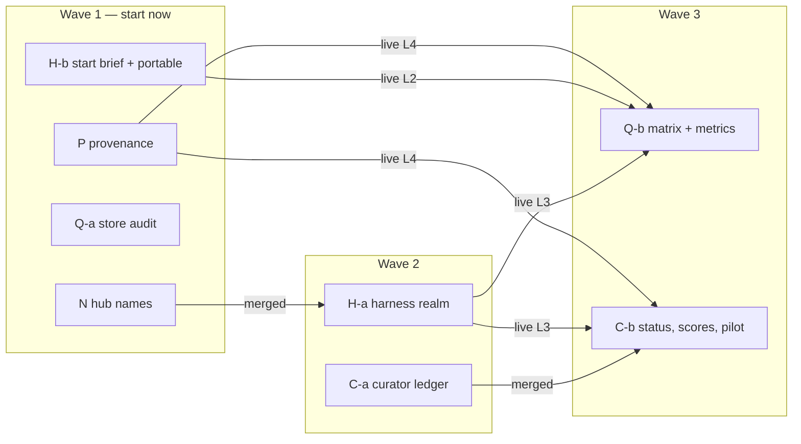

# Memory sprint: orchestration

**Status:** proposed, 2026-09-24. How to build `docs/memory-sprint-requirements.md` with
several phases in flight at once: what can run in parallel, what cannot, the contracts that let
parallel phases agree, the live changes that must run one at a time, and a paste-ready prompt
for each phase orchestrator.

## Roles

| Role | Model | Effort | How it starts |
| --- | --- | --- | --- |
| Phase orchestrator | Fable 5.1 (`fable`, the most capable model) | `ultracode` (xhigh reasoning plus automatic Workflow orchestration) | A fresh interactive session, prompt from this doc |
| Worker | Opus 5.5 (`claude-opus-5-5`) | `high` | Spawned by the orchestrator as the `phase-worker` agent (`.claude/agents/phase-worker.md`) |
| Stack | — | — | Merges PRs, says "go L<n>" for live steps, runs `!` commands |

Launch an orchestrator (PowerShell, one window per phase):

```
cd C:\Users\estac\agentic-harness
claude --model fable --effort ultracode
```

Then paste the phase's prompt below. Interactive, not `claude -p`: live steps need your go, and
some commands (Task Scheduler, `settings.json`) are refused by the auto-mode classifier and must be
typed by you with the `!` prefix.

**Why workers are spawned through the agent definition.** A Workflow script's `agent()` call has
no per-call effort; the `effort` field of an agent definition is the documented way to pin it
([sub-agents](https://code.claude.com/docs/en/sub-agents.md#optional-configuration-fields)), and
the `model` field takes the full id so a future `opus` alias change cannot move the workers off
Opus 5.5. Orchestrators therefore do development through the Agent tool with
`subagent_type: phase-worker`, and keep Workflow for fan-out work that can run at the session's
effort: parallel review, verification, surveys.

**Nesting is not guaranteed.** Agents inside a Workflow cannot spawn agents
([workflows](https://code.claude.com/docs/en/workflows.md)); whether an Agent-tool subagent can
spawn its own is not documented. Every orchestrator runs the smoke test (common contract, step 2)
before its first real task. If a worker cannot spawn, it says what fan-out it needs and the
orchestrator spawns those helpers itself.

The `phase-worker` definition is read from the checkout a session starts in, so **this doc's PR
must be merged before wave 1**, or orchestrators will not find the agent.

## Phase units

The spec's six phases split into eight units, each one PR on its own branch and worktree.

| Unit | Requirements | Branch | Worktree |
| --- | --- | --- | --- |
| N | R-N1, R-N2, R-N3 | `feat/memory-n-hub-names` | `C:/Users/estac/agentic-harness-wt-n` |
| P | R-P1, R-P2, R-P3 | `feat/memory-p-provenance` | `…-wt-p` |
| Q-a | R-Q1, R-Q3, the dogfood negative of R-Q2 | `feat/memory-qa-store-audit` | `…-wt-qa` |
| H-b | R-H4, R-H5, R-H6 | `feat/memory-hb-start-and-portable` | `…-wt-hb` |
| H-a | R-H1, R-H2, R-H3 | `feat/memory-ha-harness-realm` | `…-wt-ha` |
| C-a | R-C1, R-C2, R-C3 | `feat/memory-ca-curator-ledger` | `…-wt-ca` |
| Q-b | R-Q2 (experiment), R-Q4, R-Q5 | `feat/memory-qb-matrix` | `…-wt-qb` |
| C-b | R-C4 to R-C7, pilot | `feat/memory-cb-curator-status` | `…-wt-cb` |

A `-wt-` folder resolves to the `agentic-harness` collection, so orchestrator and worker sessions
are captured under the harness (under the `harness` realm once H-a is live).

## What runs in parallel



| Wave | Units | Starts when | Notes |
| --- | --- | --- | --- |
| 1 | N, P, Q-a, H-b | This doc merged | Run **at most three at once**; start N, P and Q-a, and H-b when one finishes. The shared contracts below make them independent. |
| 2 | H-a | N merged | Its moved notes must link to the new hub names. |
| 2 | C-a | A slot is free | Needs nothing unmerged; reads the vault and git. |
| 3 | Q-b | H-a, H-b, P merged **and** live steps L1–L4 done | The matrix asserts routing, the start brief and recorded retrievals on the real surfaces; the noise experiment needs a quiet eval baseline. |
| 3 | C-b | C-a merged **and** L3, L4 done | Its pilot writes `status.md` into the harness realm and scores with retrieval counts. |
| — | R-Q5 thresholds | Two weeks after L4 | A follow-up edit to the spec, not a unit. |

Why three at once: each orchestrator runs several Opus workers plus review fan-out, all on one
subscription, and every merge makes the other open branches merge `main` again. Four is possible;
three keeps the merge churn and the usage manageable.

## Files more than one unit touches

Whoever merges second merges `main` into their branch and resolves; never rebase a pushed branch.
Merge in this order when two are ready at once: **N → P → Q-a → H-b → H-a → C-a → Q-b → C-b**.

| File | Units | What each does there |
| --- | --- | --- |
| `hooks/lib/constants.mjs` | N, H-a | N replaces `INDEX_FILENAME`; H-a adds `harness` to `AREAS` |
| `hooks/lib/links.mjs` | N | Only N |
| `hooks/lib/note.mjs`, `capture.mjs`, `analyse.mjs` | N, P | N: title builder, 0-byte target; P: `retrievals`, `retrieved` fields and extraction |
| `hooks/install.mjs`, `hooks/doctor.mjs` | H-b, H-a | H-b: SessionStart registration, `--config`; H-a: realm row |
| `ingest/src/ingest/cli.py` (`SUBCOMMANDS`) | P, Q-a, C-a | One new entry each (`report`, `verify`, `curate`), each in its own module |
| `ingest/src/ingest/loaders/obsidian.py` | P, Q-b | P strips `retrievals` from metadata; Q-b's section filter if the experiment is kept |
| `db/migrations/` | P, C-a | New timestamped files only; never edit an applied one |
| `ingest/eval/golden.yaml` | Q-a, Q-b | Q-a: schema fields, coverage, the dogfood negative; Q-b: experiment cases |
| `scripts/nightly-ingest.ps1`, `.sh` | Q-a | Adds `verify` and `eval`; the task runs the script, so no re-registration |
| `docs/portable.md` | N, H-b, H-a | Runbook edits in different sections |

## Shared contracts

Fixed here so parallel units build against the same shape. A unit that needs to change one
opens a PR against this doc first.

**SC-1 Retrieval record in note frontmatter (P owns; H-b writes into it, Q-b and C-b read it).**

```yaml
retrievals:
  - at: '2026-09-24T14:03:11Z'
    channel: tool            # tool | session-start
    tool: search_context     # search_context | get_document | session-start
    query: '…'               # redacted, as prompts are
    filters: {collection: agentic-harness, limit: 10}
    results: ['obsidian:session-1a2b…@0.8123', 'claude-mem:461@0.8540']   # source:external_id@similarity, in rank order
retrieved: ['[[harness/agentic-harness/sessions/1a2b…|2026-09-20 · agentic-harness · …]]']
```

**SC-2 Session-start record (H-b writes; P reads).** The SessionStart hook writes
`~/.harness/state/session-start/<session_id>.json`:
`{at, session_id, cwd, realm, collection, source: "status" | "outcomes" | "none", external_ids: [...], tokens}`.
Capture turns it into one `channel: session-start` entry of SC-1 and deletes nothing: the state
folder is swept after 7 days by the nightly job (P adds that step).

**SC-3 Hub names (N owns; everyone reads).** `hubFilename(collection) → '<collection>.md'`,
`hubLink(area, collection) → '[[<area>/<collection>/<collection>|<collection>]]'`, both exported
from `hooks/lib/links.mjs`; Python mirrors them in `ingest/src/ingest/materials/render.py`.
`type: index` is unchanged.

**SC-4 Curator notes (C owns; H-b's start brief reads `status.md`).** Paths
`<realm>/<collection>/{status,ledger,history}.md` and `<realm>/curation/<date>.md`; frontmatter
`type: status | ledger | history | curation-report`, `captured_by: curator`, `generated_at`.
The start brief uses the body below the frontmatter, cut to its token budget, and falls back
when the file is absent.

**SC-5 Database objects.** P: `rag.retrieval_events`. C: schema `curate`. Both through
`uv run ingest db migrate`; orchestrators run `--dry-run` only; the live apply is a live step.

## The live lane: one at a time

Code merges in parallel; **changes to the live vault, store, hooks or scheduled tasks do not**.
Each live step is run by that unit's orchestrator only after Stack says "go L<n>", never between
02:45 and 04:30 (the nightly job and the backup), with `uv run ingest eval` before and after and
both scores recorded in the requirements doc.

Prerequisite for everything below: the nights of 2026-09-25, 26 and 27 each show
`committed -> pulled -> pushed` for both realms in `~/.claude/hooks/nightly-ingest.log`.

- [ ] **L1 — N.** `node hooks/rename-hubs.mjs --dry-run`, read, `--apply`; sync; ingest (19
  `metadata-updated`); eval. MANUAL: install Front Matter Title in Obsidian and set it to show
  `title` in the graph and explorer.
- [ ] **L2 — H-b.** `node hooks/install.mjs --dry-run`, then Stack runs the install (it edits
  `settings.json`) to register SessionStart; `gh repo create emstacho-su/claude-config --private`
  and the first push of the allowlist, after Stack reads the dry-run file list; bootstrap trial on a
  scratch user profile.
- [ ] **L3 — H-a.** `init-realm --realm harness`, the private remote `vault-harness`, Stack adds
  `harness:push` to `~/.harness/machine.env`; `move-to-realm --dry-run`, Stack reads every line,
  `--apply`; sync; ingest (only `metadata-updated`, 0 deleted); eval.
- [ ] **L4 — P.** `ingest db migrate --dry-run`, then live; reinstall the hook; full ingest; check that
  `retrieved:` draws edges in the graph; first `ingest report retrievals`.
- [ ] **L5 — Q-a.** First nightly with `verify` and `eval`; read the log; fix or explain every
  finding.
- [ ] **L6 — Q-b.** The noise experiment (re-ingest, eval before and after, keep or revert); new
  golden cases for the harness realm; the location matrix run (costs `claude -p` usage, about ten
  sessions).
- [ ] **L7 — C-b.** `curate` migration; pilot `agentic-harness` (Stack samples 20 extractions and 10
  ledger entries and signs off `status.md` and `history.md`), then `bb2dash`, then all; Stack
  registers the weekly task (Sunday 04:30, after the backup) with `!`.

## Common orchestrator contract

Every prompt below points here. The orchestrator follows it in order.

1. **Read** `CONTEXT.md`, `docs/memory-sprint-requirements.md` (your requirements, *Gates and
   order*, *Facts*), and this doc (*Files more than one unit touches*, *Shared contracts*, *The
   live lane*). Search the RAG store (`search_context`, `collection: agentic-harness`) for prior
   sessions on the files you will touch. Re-check every file:line the spec cites against `main`;
   code moves.
2. **Set up and smoke-test.** `git fetch`; `git worktree add <your worktree> -b <your branch>
   origin/main`. Spawn one `phase-worker` with: "Report your model id, then spawn one Explore
   subagent to list `hooks/lib/` and relay its answer." Record in your notes whether the worker is
   Opus 5.5 and whether nesting worked; if not, you spawn any helper a worker asks for.
3. **Plan.** Break the unit into tasks of one commit each, with the files each task owns. Tasks
   that own disjoint files may run as parallel workers; tasks that share a file run in sequence.
   Show Stack the task list with checkboxes before the first worker starts.
4. **Build.** One `phase-worker` per task, via the Agent tool, given: the worktree path, the
   requirement IDs, the files it owns, the contracts it must honour, and the done-when. Review each
   worker's diff yourself; run the full suites for every component touched; commit with a
   conventional message ending in the Co-Authored-By line; one commit per task.
5. **Gate.** All three suites green (`npm test` in `hooks/`; `uv run pytest` in `ingest/`;
   `npm run typecheck && npm test` in `mcp-server/`). `uv run ingest eval` read-only before and after
   if the unit touches capture, chunking or `rag.search`. `/code-review` with the explicit range
   `origin/main...<branch>`, run from inside your worktree; if it returns nothing, use a
   `feature-dev:code-reviewer` agent on the same range. Fix every CRITICAL and HIGH.
   `/security-review` on the same range where your prompt says so.
6. **Ship.** Push with `-u`; open the PR with a summary, the requirement IDs and a test plan with
   checkboxes, ending with the Claude Code line. Stack merges; you do not, unless told to.
7. **Live step.** Write the exact commands for your lane step, dry runs first, into the PR
   description. Run them only on "go L<n>" and only while the lane is free.
8. **Record.** After the live step, a `docs:` commit adds your unit's record (what ran, counts,
   eval scores, anything deferred) under your requirements in the spec, like the Phase D record in
   `docs/portable.md`.
9. **Hand back.** End with: requirements done or not (checkboxes), PR link, what Stack must do
   next, anything deferred.

Standing rules: never `rm` in the vault (move to `~/.claude-archive/<date>/`); never write
`settings.json`, `machine.env` or scheduled tasks yourself — give Stack the `!` command; never
print a secret or `claude mcp get` output; never force-push, rebase a pushed branch, or retry a
denied command in another form; Windows binaries need `C:/Users/...` paths.

## Orchestrator prompts

Each prompt is complete; paste it as the first message of a fresh session launched as above.

### N — hub names (wave 1)

```
ultracode. You are the orchestrator for unit N of the agentic-harness memory sprint.
Repo: C:/Users/estac/agentic-harness. Follow the "Common orchestrator contract" in
docs/memory-sprint-orchestration.md exactly. Worktree C:/Users/estac/agentic-harness-wt-n,
branch feat/memory-n-hub-names. Delegate all development to phase-worker agents (Opus 5.5,
high effort); you plan, review, commit and gate.

Scope: R-N1, R-N2, R-N3 in docs/memory-sprint-requirements.md. You own contract SC-3.
Specifics:
- hooks/rename-hubs.mjs must be idempotent and dry-run first; it rewrites up: links that name a
  hub and nothing else; keep `type: index` and the UUID id.
- Every place that names index.md: constants, links, notes-io ensureIndex, link-sessions,
  migrate-sessions, ingest/src/ingest/materials/render.py, the tests, CONTEXT.md, docs/ingestion.md,
  docs/portable.md.
- R-N2: subagent `up` path-qualified; capture overwrites a 0-byte or frontmatter-less file at its
  target path. Find where the parent note's folder is known at SubagentStop time.
- R-N3: the title builder handles slash commands, pasted blocks and non-ASCII; the Front Matter
  Title install is a MANUAL runbook line, not code.
- Eval before and after (golden case ist323-index must still hit).
Live step: L1. No /security-review needed.
```

### P — retrieval provenance (wave 1)

```
ultracode. You are the orchestrator for unit P of the agentic-harness memory sprint.
Repo: C:/Users/estac/agentic-harness. Follow the "Common orchestrator contract" in
docs/memory-sprint-orchestration.md exactly. Worktree C:/Users/estac/agentic-harness-wt-p,
branch feat/memory-p-provenance. Delegate all development to phase-worker agents (Opus 5.5,
high effort); you plan, review, commit and gate.

Scope: R-P1, R-P2, R-P3. You own contracts SC-1 and SC-5 (rag.retrieval_events) and consume SC-2.
Specifics:
- Task 1 is the spike: can the MCP server return structuredContent that Claude Code keeps in the
  transcript JSONL? Check a real transcript under ~/.claude/projects/ read-only. Decide
  structuredContent vs parsing the stable text lines, and pin the choice with a contract test in
  mcp-server/.
- Extraction runs in both the hook and the nightly sweep (they share capture()); subagent
  transcripts too. Queries go through hooks/lib/redact.mjs.
- SC-2: read ~/.harness/state/session-start/<session_id>.json when present; add the 7-day sweep
  of that folder to both nightly scripts.
- Ingest projects `retrievals` into rag.retrieval_events idempotently and strips it from
  documents.metadata. Migration in db/migrations/ with a new timestamp; --dry-run only.
- `uv run ingest report retrievals [--json] [--since]` as its own module registered in
  SUBCOMMANDS. The Artifact dashboard is built after L4 from real data, not now.
Live step: L4. /security-review is required (user text written to disk and the store).
```

### Q-a — store audit and golden coverage (wave 1)

```
ultracode. You are the orchestrator for unit Q-a of the agentic-harness memory sprint.
Repo: C:/Users/estac/agentic-harness. Follow the "Common orchestrator contract" in
docs/memory-sprint-orchestration.md exactly. Worktree C:/Users/estac/agentic-harness-wt-qa,
branch feat/memory-qa-store-audit. Delegate all development to phase-worker agents (Opus 5.5,
high effort); you plan, review, commit and gate.

Scope: R-Q1 (uv run ingest verify), R-Q3 (golden-set fields, coverage, per-collection report,
nightly eval with ingest/eval/history.jsonl), and from R-Q2 only the dogfood negative case:
"which chunks were retrieved by a session, retrieval logging, provenance" (add it now; note in the
case that it retires when unit P goes live).
Specifics:
- verify is read-only; exit 0 clean, 1 findings, 2 could not run; each check tested against a
  fixture store with one planted defect. The re-embed sample uses the real embedder and the pinned
  cache (FASTEMBED_CACHE_DIR).
- Golden coverage: propose the new cases from the live store read-only and show them to Stack;
  never label a case you have not read the document for. Harness-realm cases wait for Q-b (the
  realm does not exist yet); write the rest now.
- Add verify and eval steps to scripts/nightly-ingest.ps1 and .sh after ingest; a failure is logged
  and does not change the job's exit code rule.
Live step: L5. No /security-review needed.
```

### H-b — start brief and portability (wave 1, fourth slot)

```
ultracode. You are the orchestrator for unit H-b of the agentic-harness memory sprint.
Repo: C:/Users/estac/agentic-harness. Follow the "Common orchestrator contract" in
docs/memory-sprint-orchestration.md exactly. Worktree C:/Users/estac/agentic-harness-wt-hb,
branch feat/memory-hb-start-and-portable. Delegate all development to phase-worker agents
(Opus 5.5, high effort); you plan, review, commit and gate.

Scope: R-H4 (SessionStart brief), R-H5 (private claude-config repo), R-H6 (bootstrap).
You write contract SC-2 and read SC-4.
Specifics:
- Before building R-H4, confirm the SessionStart hook's input and output (additionalContext,
  matchers startup/resume, timeout) with a claude-code-guide agent, and cite the doc in the code.
  It resolves the collection with the capture hook's own deriveCollection, fails open within 2 s,
  and writes the SC-2 record. It must work before H-a exists (projects realm) and after.
- R-H5: allowlist and denylist as data with tests; the secret scan uses hooks/lib/redact.mjs rules
  and refuses on a hit; install.mjs --config --dry-run|--apply. Creating the GitHub repo is a live
  step, not yours to do early.
- R-H6: scripts/bootstrap.ps1 and .sh with --dry-run, stop at the first failure, final reminder
  lines for the MANUAL steps (PAT, Front Matter Title).
Live step: L2. /security-review is required (R-H5 reads a folder that holds credentials).
```

### H-a — the harness realm (wave 2, after N is merged)

```
ultracode. You are the orchestrator for unit H-a of the agentic-harness memory sprint.
Repo: C:/Users/estac/agentic-harness. Follow the "Common orchestrator contract" in
docs/memory-sprint-orchestration.md exactly. Worktree C:/Users/estac/agentic-harness-wt-ha,
branch feat/memory-ha-harness-realm. Delegate all development to phase-worker agents (Opus 5.5,
high effort); you plan, review, commit and gate. Unit N is merged; use its SC-3 helpers.

Scope: R-H1, R-H2, R-H3.
Specifics:
- R-H2's routing rules are data in one module with a table-driven test covering every cwd the spec
  lists, including scratchpad cwds under AppData/Local/Temp/claude/<sanitised-cwd>/ decoded back to
  their original cwd.
- R-H3: hooks/move-to-realm.mjs re-resolves each note with the new rules; the dry run prints
  from, to and reason per note. The Python test proves one full ingest run over a note moved between
  realms updates collection and _ingest.realm and prunes nothing (prune runs after the load,
  ingest/src/ingest/cli.py around line 275).
- machine.env and the GitHub repo are Stack's to change during L3; give the exact commands.
- Eval before and after.
Live step: L3 (only after L1 is done). No /security-review needed.
```

### C-a — curator ledger (wave 2)

```
ultracode. You are the orchestrator for unit C-a of the agentic-harness memory sprint.
Repo: C:/Users/estac/agentic-harness. Follow the "Common orchestrator contract" in
docs/memory-sprint-orchestration.md exactly. Worktree C:/Users/estac/agentic-harness-wt-ca,
branch feat/memory-ca-curator-ledger. Delegate all development to phase-worker agents (Opus 5.5,
high effort); you plan, review, commit and gate.

Scope: R-C1, R-C2, R-C3 and the curator's shape and safety rules in Phase C of the spec. You own
the `curate` schema (SC-5) and the ledger part of SC-4.
Specifics:
- `uv run ingest curate <stage>`, its own package under ingest/src/ingest/curate/, registered in
  SUBCOMMANDS. A Judge protocol; the claude -p backend (--json-schema, --output-format json,
  --model, no tools allowed) and a fake judge for every test. No test ever calls a real model.
- Inventory reads the vault including sdk-* worker notes; git facts via git and gh.
- The substring guard, the (note id, content_hash, extractor_version) cache, the per-run budget
  and --dry-run cost estimate are each tested.
- The ledger's state machine and stable ISSUE-<collection>-NNN ids are tested for reruns.
- Real judge calls happen only in the L7 pilot, never in this unit.
Live step: none (C-b runs the pilot). /security-review is required (untrusted notes reach an LLM
and its output is written to disk).
```

### Q-b — noise experiment, location matrix, usage metrics (wave 3)

```
ultracode. You are the orchestrator for unit Q-b of the agentic-harness memory sprint.
Repo: C:/Users/estac/agentic-harness. Follow the "Common orchestrator contract" in
docs/memory-sprint-orchestration.md exactly. Worktree C:/Users/estac/agentic-harness-wt-qb,
branch feat/memory-qb-matrix. Delegate all development to phase-worker agents (Opus 5.5, high
effort); you plan, review, commit and gate. Units N, P, H-a, H-b and Q-a are merged and live
steps L1-L4 are done; check both before starting and stop if not.

Scope: R-Q2 (the section-filter experiment, `verify --noise`), R-Q4 (scripts/location-matrix.ps1),
R-Q5 (the four usage numbers in `ingest report retrievals`), and the harness-realm golden cases
Q-a deferred.
Specifics:
- R-Q2 is kept only if hit@3 and MRR do not drop and the noise share falls; otherwise revert and
  record the numbers in docs/retrieval.md's table either way.
- R-Q4 runs claude -p from each listed cwd against a scratch vault (HARNESS_VAULT override); its
  assertion helpers are unit-tested on saved transcripts; the desktop, cloud and VM rows are MANUAL
  and recorded with a date.
- R-Q5 sets no thresholds; it reports the baseline.
Live step: L6. No /security-review needed.
```

### C-b — status, history, scores and the pilot (wave 3)

```
ultracode. You are the orchestrator for unit C-b of the agentic-harness memory sprint.
Repo: C:/Users/estac/agentic-harness. Follow the "Common orchestrator contract" in
docs/memory-sprint-orchestration.md exactly. Worktree C:/Users/estac/agentic-harness-wt-cb,
branch feat/memory-cb-curator-status. Delegate all development to phase-worker agents (Opus 5.5,
high effort); you plan, review, commit and gate. C-a is merged and L3, L4 are done; check before
starting.

Scope: R-C4, R-C5, R-C6, R-C7 and the pilot. You finish contract SC-4 (status, history,
curation-report).
Specifics:
- The plan parsers are tested against docs/memory-sprint-requirements.md and
  docs/vault-migration-requirements.md; hub notes gain `kind:` and `plan_sources:` (bb2dash's plan
  sources are its docs/planning/ briefs).
- Scores live in `curate` tables, never in note frontmatter; the curation report has one checkbox
  per candidate and the R-C7 tally; the promotion and demotion rule is tested.
- The weekly run also refreshes the P3 retrievals dashboard (a private Artifact).
- Pilot order: agentic-harness, then bb2dash, then all; each step waits for Stack's sign-off.
- Weekly task registration is Stack's (!), Sunday 04:30.
Live step: L7. /security-review is required.
```

## After the sprint

Next sprint's input: the R-C7 tally (is condense or prune ready for automatic?), the R-Q5
baseline and its thresholds, and the Phase G triggers.
