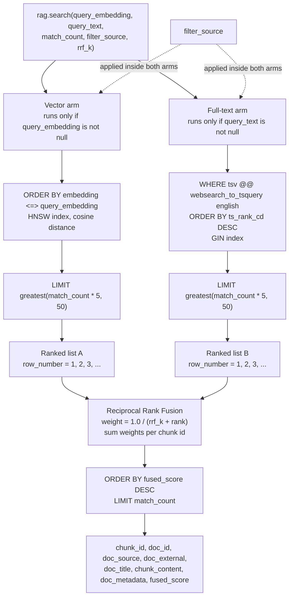

# Hybrid retrieval with Reciprocal Rank Fusion

All retrieval goes through one database function, `rag.search()`. It runs two
independent searches over the same chunks and merges their results into a single
ordering.

> **Status.** The function is applied and live. The store holds 0 rows, so no
> retrieval quality has been measured yet. Numbers in the worked example below
> are illustrative.

---

## Why two searches

Dense vector search and keyword search fail in opposite directions.

| | Vector search | Full-text search |
| --- | --- | --- |
| Finds | Meaning, paraphrase, related concepts | Exact terms |
| "database connection pooling" also matches | "pgbouncer setup", "too many clients" | only literal occurrences |
| `ENOENT` | Poorly — rare tokens are weakly represented | Exactly |
| A UUID or a filename | Badly | Exactly |
| Wrong-but-plausible results | Common | Rare |
| Misses when wording differs | Rare | Common |

An agent's corpus contains both kinds of query. "What did I decide about
retrieval ranking?" is semantic. "Where did that `chunks_embedding_idx` error
come from?" is lexical. A store that only does one of them is frustrating in a
predictable way roughly half the time.

Running both and fusing costs one extra index scan and removes the whole failure
class.

---

## The retrieval flow



Points worth noticing in that diagram:

- **Both arms are optional.** Each has a `where query_… is not null` guard, so
  passing only an embedding gives pure vector search and only text gives pure
  full-text search. The same function serves all three modes; callers do not
  branch.
- **`filter_source` is pushed into each arm**, not applied after fusion.
  Filtering afterwards would let irrelevant sources consume candidate slots and
  return fewer than `match_count` rows.
- **Each arm over-fetches.** `greatest(match_count * 5, 50)` retrieves five times
  the requested rows, floor 50. Fusion needs a pool deep enough to find
  agreement; if each arm returned only 10, a chunk ranked 11th by both — a strong
  consensus signal — would never be seen.
- **`websearch_to_tsquery`** rather than `to_tsquery`. It accepts everyday query
  syntax (quoted phrases, `or`, leading `-` to exclude) and, critically, never
  raises a syntax error on arbitrary input. `to_tsquery` throws on a stray
  operator, which would turn a user's punctuation into a failed search.
- **`ts_rank_cd`** — cover-density ranking, which accounts for how close the
  matched terms are to each other. For multi-word queries that is a better signal
  than raw term frequency.

---

## The RRF formula

For each chunk `c`, over each ranked list `L` that contains it:

```
score(c) = Σ  1 / (k + rank_L(c))
          L
```

with `k = rrf_k`, default **60**. In SQL:

```sql
select vec.cid, 1.0 / (rrf_k + vec.rnk) as w from vec
union all
select txt.cid, 1.0 / (rrf_k + txt.rnk) as w from txt
-- then: group by cid, sum(w)
```

Only the **ordinal position** of a result enters the formula. Cosine distance and
`ts_rank_cd` values are used to sort each arm and are then thrown away.

---

## Why RRF instead of mixing scores

The obvious alternative is a weighted blend: `0.7 × vector_score + 0.3 ×
text_score`. It does not work, for a specific reason.

The two scores are not on the same scale, and they are not on any fixed scale:

- **Cosine distance** is bounded in `[0, 2]`, and **lower is better**. In
  practice, embeddings of related English text cluster in a narrow band — a good
  match and a mediocre one might be 0.18 and 0.31.
- **`ts_rank_cd`** is an unbounded positive number where **higher is better**.
  Its magnitude depends on term frequency, document length, the number of query
  terms and their proximity. A rank of 0.09 can be excellent for one query and
  poor for another.

To blend them you must first normalise, and every normalisation strategy
introduces a new failure:

| Strategy | Failure |
| --- | --- |
| Min-max over the candidate set | Scores depend on which other rows happened to be retrieved. The best result in a set of bad results normalises to 1.0 — a pile of garbage produces a confident-looking top hit. |
| Fixed divisor per metric | Requires knowing each metric's real range in advance. `ts_rank_cd` has no upper bound to divide by. |
| Z-score | Assumes a distribution the scores do not have, and still breaks when one arm returns two rows. |

All of these make fusion depend on the shape of the candidate set rather than on
what the query actually matched. Worse, the failure is invisible: results still
come back ordered, so nothing looks broken.

RRF sidesteps the entire problem. Rank 1 is rank 1 whether cosine distance was
0.02 or 0.4. There is nothing to normalise because no score crosses between the
arms. Adding a third retrieval arm later — a reranker, a graph walk — needs no
recalibration of the existing two, which is not true of any weighted scheme.

RRF comes from Cormack, Clarke and Buettcher (2009), where it beat considerably
more complicated learned fusion methods across TREC collections. `k = 60` is
their value and has held up as a default.

---

## What `k = 60` actually does

`k` flattens the curve. Without it, rank 1 scores 1.0 and rank 2 scores 0.5 —
the top of one list would dominate everything. With `k = 60`:

| Rank | `1 / (60 + rank)` |
| ---: | ---: |
| 1 | 0.01639 |
| 2 | 0.01613 |
| 5 | 0.01538 |
| 10 | 0.01429 |
| 50 | 0.00909 |

Adjacent ranks are nearly equal, so **appearing in both lists matters more than
topping one of them**:

| Chunk | Vector rank | Text rank | Fused score |
| --- | ---: | ---: | ---: |
| A | 5 | 5 | 0.01538 + 0.01538 = **0.03077** |
| B | 1 | — | 0.01639 + 0 = 0.01639 |
| C | — | 1 | 0 + 0.01639 = 0.01639 |
| D | 12 | 8 | 0.01389 + 0.01471 = **0.02860** |

Chunk A wins despite being nobody's favourite, because both methods independently
agree it is relevant. Chunk D, mediocre in both, still outranks B and C, each of
which one method loved and the other never surfaced. That is the intended
behaviour: agreement between two methods that fail differently is strong
evidence, and a lone enthusiastic vote is weak evidence.

Lowering `k` sharpens the curve and lets top-ranked singletons win. Raising it
flattens further and weights consensus even more heavily. It is exposed as a
parameter, so it can be tuned per query without a migration.

---

## What RRF gives up

- **Magnitude is discarded.** A near-exact match and a barely-relevant one are
  both "rank 1". Where the top hit is dramatically better than everything else,
  RRF cannot express that.
- **No arm weighting by default.** Every list counts equally. If the vector arm
  were consistently better on this corpus, RRF would not know. A per-arm
  multiplier could be added, at the cost of reintroducing a tuned constant.
- **Ordering only.** `fused_score` is a fusion artifact, not a relevance
  probability. It is not comparable across queries and should never be shown to a
  user as a confidence value or thresholded.

For this use case those are acceptable. The consumer is an agent that reads a
handful of chunks and decides for itself which ones matter — the job of retrieval
is to get the right material into that set, not to rank it perfectly.

---

## The contract

```sql
rag.search(
  query_embedding extensions.vector(384) default null,
  query_text      text                   default null,
  match_count     int                    default 10,
  filter_source   text                   default null,
  rrf_k           int                    default 60
)
returns table (
  chunk_id      bigint,
  doc_id        bigint,
  doc_source    text,
  doc_external  text,
  doc_title     text,
  chunk_content text,
  doc_metadata  jsonb,
  fused_score   double precision
)
```

Pass either argument or both. `filter_source` narrows to one producer
(`obsidian`, `claude-mem`, `hermes`).

**Every client goes through this function.** Hand-rolled SQL in the MCP server or
in a future Hermes client would give each agent its own private definition of
relevance, and the two would drift apart in ways that are extremely hard to
notice — both would return results, both would look fine, and they would disagree
about what the knowledge base says.
