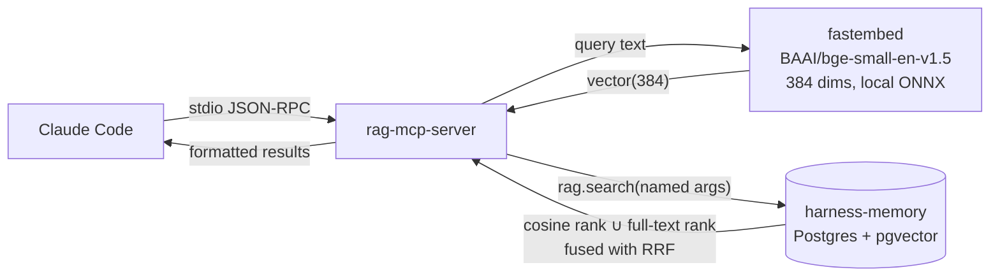

# RAG MCP Server

stdio MCP server that gives Claude Code (and later Hermes Agent) read access to the
shared knowledge store: six months of migrated agent memory plus, in time, an Obsidian
vault — in Supabase Postgres with pgvector, tagged by project or class.

Two tools: **`search_context`** (hybrid retrieval) and **`get_document`** (full document
by natural key). All ranked retrieval goes through the `rag.search()` SQL function, so
every client shares one definition of search.

Live store: **1,305 documents / 2,278 chunks across 17 collections.**

---

## ⚠ There are two RAG stores. Never cross them.

|  | **harness-memory** | **bb2dash** |
| --- | --- | --- |
| Project ref | `hqkytnyiiuxovnnyixye` | `goultdzqcavefcgnifdy` |
| Contents | Session history by project/class | Class materials + the bb2dash app |
| Schema | `rag` | `public` |
| Embedding model | `bge-small-en-v1.5` (local fastembed) | `gte-small` (Supabase server-side) |
| Dimensions | 384 | 384 |

**This server owns harness-memory only.** Both stores are 384-dim, so pointing this
server at bb2dash raises no error — it silently returns confidently-ranked nonsense from
a different vector space. `loadConfig` refuses a `DATABASE_URL` containing the bb2dash
project ref, but that guard only catches the one mistake it knows about.

---

## How it works



The query is sent to `rag.search()` **as both a vector and raw text**. The function ranks
chunks twice — cosine distance over `rag.chunks.embedding`, and `ts_rank_cd` over
`rag.chunks.tsv` — then fuses the two ranked lists with Reciprocal Rank Fusion. Sending
only one of the two collapses the fusion to a single list and wastes half the recall.

### Arguments are bound by name, not position

```sql
from rag.search(
  query_embedding   => $1::extensions.vector,
  query_text        => $2::text,
  match_count       => $3::int,
  filter_source     => $4::text,
  filter_collection => $5::text,
  rrf_k             => $6::int,
  max_per_document  => $7::int,
  min_similarity    => $8::double precision
)
```

This is not stylistic. The signature has already changed twice; when
`filter_collection` was inserted at position 5, the previous positional call put an `int`
where a `text` was expected, no overload matched, and Postgres reported it as
**42883 "function does not exist"** — which reads like a missing migration and sends you
debugging the wrong thing entirely. Named binding survives insertions and reorderings.
The `hintFor` mapping for 42883 now leads with signature drift for the same reason.

### Embedding parity is load-bearing

`rag.chunks.embedding` was written by the Python `fastembed` implementation of
`BAAI/bge-small-en-v1.5` at 384 dimensions. If retrieval embeds with a different model,
the database still returns rows — just meaningless ones. There is no error to notice.

So the server hardcodes `BAAI/bge-small-en-v1.5` as the only accepted model and refuses to
start with any other; asserts every vector is exactly 384 finite floats before it reaches
SQL, twice; and refuses the query outright if the embedder's model id does not match the
configured ingestion model. `npm run verify:embedder` checks all of this offline.

---

## Setup

```powershell
cd C:/Users/estac/agentic-harness/mcp-server
npm install
npm run build
npm test
npm run verify:embedder   # downloads ~130 MB on first run
```

Requires Node >= 20.11 (developed and verified on 24.13.0 at `C:/Program Files/nodejs/node.exe`).

> **Windows paths.** Native binaries — `node.exe` included — cannot read MSYS `/c/Users/...`
> paths; they resolve to `C:\c\Users\...` and fail with `ENOENT`. Use `C:/Users/...` in every
> path you hand to Node, including `FASTEMBED_CACHE_DIR`, `DATABASE_CA_CERT`, and the `args`
> in `settings.json`.

### First run downloads a model

`fastembed` pulls the `fast-bge-small-en-v1.5` ONNX artifact (~130 MB) on the first
`search_context` call, then caches it. Model loading is deferred until that first call so
the MCP handshake stays fast. Measured on this machine: **3.7 s** for the first embed
(load + warm-up), **~170 ms** after. Keep the cache **outside OneDrive** — binary indexes
plus OneDrive sync caused file-lock failures in this project before.

---

## Environment variables

| Variable | Required | Default | Purpose |
| --- | --- | --- | --- |
| `DATABASE_URL` | **yes** | — | Direct Postgres connection to harness-memory. Must be the postgres/service role. |
| `DATABASE_CA_CERT` | recommended | — | Path to the pinned Supabase CA (`certs/prod-ca.crt`). Use a `C:/...` path. |
| `FASTEMBED_CACHE_DIR` | recommended | `./local_cache` | Where the ONNX model is cached. |
| `DATABASE_SSL` | no | on | `disable` turns TLS off for a local Postgres. |
| `RAG_VECTOR_TYPE` | no | `extensions.vector` | Fully-qualified pgvector type name. |
| `RAG_DEFAULT_MATCH_COUNT` | no | `10` | `limit` when the caller omits it. |
| `RAG_MAX_MATCH_COUNT` | no | `50` | Hard ceiling on `limit`. |
| `RAG_MAX_PER_DOCUMENT` | no | `3` | Chunks per document in one result set. |
| `RAG_MIN_SIMILARITY` | no | `0.70` | Cosine floor on the semantic arm. `none` removes it. |
| `RAG_RRF_K` | no | `60` | RRF constant passed to `rag.search()`. |
| `RAG_QUERY_PREFIX` | no | `""` | Instruction prefix before embedding. Leave unset. |

See `.env.example`. Nothing is hardcoded and no secret is written to disk by this server.

TLS is either verified against the pinned CA or against system roots. There is deliberately
no `rejectUnauthorized: false` option — silently accepting any certificate is not offered as
a convenience.

### Why there is no PostgREST / supabase-js option

Probed against the live project and rejected:

```
POST /rest/v1/rpc/search   (Content-Profile: rag)
-> 406 PGRST106  "Only the following schemas are exposed: public, graphql_public"
```

Schema `rag` is not exposed and will not be. `DATABASE_URL` is the only connection path. If
`SUPABASE_URL` / `SUPABASE_SERVICE_ROLE` are present without `DATABASE_URL`, the server
refuses to start and says exactly this.

### About `RAG_QUERY_PREFIX`

BGE's model card suggests prefixing retrieval queries with
`"Represent this sentence for searching relevant passages: "`. **Neither `fastembed` nor
this project's ingestion applies it**, and v1.5 was trained to need it less. Setting it on
one side only puts queries and documents in different regions of the space. Change both or
neither.

---

## Register with Claude Code

MCP servers are **not** read from `~/.claude/settings.json`. User-scope servers live in
`~/.claude.json` under a top-level `mcpServers` key, and the supported way to write one is the
`claude mcp` CLI. Run `npm run build` first — the entry point is `dist/index.js`, not `src/`.

```powershell
claude mcp add-json rag "@{...}" -s user     # see the JSON below
claude mcp get rag                          # shows the stored definition
claude mcp list                             # spawns it and completes the MCP handshake
```

The JSON to pass (fill in the real connection string; it is stored in `~/.claude.json`, which is
local and never committed — do not paste it anywhere else):

```json
{
  "type": "stdio",
  "command": "C:/Program Files/nodejs/node.exe",
  "args": ["C:/Users/estac/agentic-harness/mcp-server/dist/index.js"],
  "env": {
    "DATABASE_URL": "postgresql://<user>:<password>@aws-0-us-east-1.pooler.supabase.com:5432/postgres",
    "DATABASE_CA_CERT": "C:/Users/estac/agentic-harness/certs/prod-ca.crt",
    "FASTEMBED_CACHE_DIR": "C:/Users/estac/agentic-harness/mcp-server/.fastembed-cache"
  }
}
```

To avoid typing the secret on a command line, build the JSON from `.env` in a one-liner and pass
it as a variable — the repo README shows the exact incantation.

Verify after restarting Claude Code: the tools appear as `mcp__rag__search_context` and
`mcp__rag__get_document`. Startup diagnostics go to **stderr**; stdout carries JSON-RPC only,
so nothing in this server may ever print to stdout (this is why the fastembed download
progress bar is explicitly disabled).

---

## Tools

### `search_context`

| Parameter | Type | Required | Default | Notes |
| --- | --- | --- | --- | --- |
| `query` | string, 1–2000 chars | yes | — | Embedded *and* passed verbatim to full-text search. |
| `limit` | integer, 1–50 | no | `10` | Clamped to `RAG_MAX_MATCH_COUNT`. |
| `source` | `"obsidian"` \| `"claude-mem"` \| `"hermes"` | no | all | Narrows to one producer. |
| `collection` | string | no | all | Narrows to one project or class. **Exact and case-sensitive.** |
| `min_similarity` | number, 0–1 | no | `0.70` | Cosine floor on the semantic arm. Lower it to widen the net. |

`collection` is an open string rather than an enum because 17 exist today and vault
ingestion will add more. Live values, most populated first: `estac` (513),
`ai-news-agent` (404), `quant-edge-tracker` (154), `portfolio website` (47),
`claude-mem` (46), `wta dog finder` (31), `team project` (30), `ist335` (14), `ce2` (11),
and eight more. Note they are **lowercase** — `IST335` matches nothing.

Because a mistyped collection and a genuinely empty topic both return zero rows, an empty
result that had a `collection` filter applied lists the collections that actually exist.

**Example call**

```json
{ "name": "search_context",
  "arguments": { "query": "transformational versus transactional leadership",
                 "collection": "ist335", "limit": 4 } }
```

**Example response** (real output, trimmed)

```
3 results for "transformational versus transactional leadership" (collection "ist335", top 4).
Hybrid search: semantic (cosine) and full-text ranked separately, then fused with RRF.
Judge relevance by `similarity` — real cosine, where ~0.8 is a strong match and below
~0.65 is usually unrelated. `rrf` only sets the ordering and is not a percentage.

### 1. (untitled)
- source: claude-mem
- collection: ist335
- external_id: prompt:229
- similarity: 0.8740
- rrf: 0.016393 (ordering only)
- ids: doc 1041, chunk 1712

**Transformational vs. Transactional Leadership**
- *Transactional* — based on exchanges/rewards; manages through contingent reinforcement…

---
### 2. … similarity: 0.7565
### 3. … similarity: 0.7054

To read a full document, call get_document with the `source` and `external_id` shown above.
```

Four results were requested and three came back: all of `ist335`'s matching chunks belong
to one document, and `max_per_document` caps a single document at three slots so one long
note cannot crowd out every other source.

#### Two scores, two meanings

- **`similarity`** is real cosine and is interpretable in absolute terms. Measured on this
  corpus: strong hits **0.79–0.87**, unrelated **0.48–0.66**. Judge relevance by this.
- **`rrf`** is a raw Reciprocal Rank Fusion sum (`1/(k+rank)` per arm, `k=60`), so its
  ceiling is `2/61 ≈ 0.0328`. It orders results and means nothing on its own. It is never
  presented as a percentage.

#### An empty result is a valid answer

With the `0.70` floor, `"banana bread recipe with walnuts"` returns **nothing** — correctly,
because the store holds nothing about baking. Before the floor existed it returned the
nearest irrelevant neighbours at the RRF floor, which looked like an answer. The no-results
message says so explicitly rather than implying a failure, and `isError` stays false.

The floor gates the **vector arm only**. A chunk that matched the query terms literally can
still surface below it — that is independent lexical evidence, so it is shown and labelled
rather than filtered out:

```
- similarity: 0.6184 (below the 0.7 floor — surfaced by literal keyword match,
  not semantic similarity)
```

### `get_document`

Point lookup of one full document by its natural key. This is not ranking, so it reads
`rag.documents` on the `UNIQUE (source, external_id)` key rather than going through
`rag.search()`. All *ranked* retrieval still goes through the shared function.

| Parameter | Type | Required | Notes |
| --- | --- | --- | --- |
| `external_id` | string, 1–1024 chars | yes | Vault-relative path for `obsidian`; for `claude-mem` a bare observation id or a `summary:` / `prompt:` prefixed id. |
| `source` | string | yes | Producer that owns the document. Known: `obsidian`, `claude-mem`, `hermes`. |

```json
{ "name": "get_document", "arguments": { "source": "claude-mem", "external_id": "315" } }
```

Returns title, source, collection, agent, ISO-8601 timestamps, metadata, then the full body.

---

## Error handling

Every failure carries a `Fix:` line. Configuration problems are fatal at startup; everything
else comes back as an MCP tool error the model can read and act on.

| Situation | Behaviour |
| --- | --- |
| `DATABASE_URL` missing | Exits 1 naming the variable and the right project ref. |
| `DATABASE_URL` points at bb2dash | Exits 1 — different embedding model, would fail silently. |
| REST credentials only | Exits 1 explaining the PGRST106 rejection. |
| `DATABASE_CA_CERT` unreadable | Exits 1, and points at the `/c/...` vs `C:/...` trap. |
| `RAG_VECTOR_TYPE` not an identifier | Exits 1 — it is interpolated into SQL. |
| No `rag.search()` overload (`42883`) | Tool error leading with **signature drift**, then migrations. |
| `rag.search()` raised (`P0001`) | Tool error carrying the function's own message. |
| Permission denied (`42501`) | Tool error: RLS has no policies, use the service role. |
| TLS verification failure | Tool error: set `DATABASE_CA_CERT`. |
| Unreachable / refused / timed out | Tool error naming the Postgres error code and the fix. |
| pgvector in another schema | Tool error: set `RAG_VECTOR_TYPE`. |
| Wrong embedding width | `DimensionMismatchError` **before** any query runs. |
| Embedder model ≠ ingestion model | Refused before any query runs. |
| No results | **Not an error** — a plain statement that nothing relevant exists. |
| Document not found | **Not an error** — echoes the key that missed. |

Nothing is silently swallowed, with one deliberate exception: if the collection listing that
enriches an empty result fails, that failure is dropped rather than turning a valid empty
answer into an error.

---

## Layout

```
mcp-server/
  src/
    index.ts              stdio bootstrap, signal handling, stderr logging
    server.ts             registers the two tools on an McpServer
    config.ts             env parsing + validation, model/dimension constants, TLS
    embedder.ts           fastembed wrapper, model identity + dimension guards
    format.ts             LLM-readable rendering; similarity vs RRF labelling
    errors.ts             typed errors carrying actionable hints
    db/
      index.ts            pg Pool factory, TLS wiring
      postgres.ts         named-argument rag.search(), documents, error mapping
      types.ts            row shapes, RagClient interface, pgvector literal
    tools/
      schemas.ts          Zod input schemas shared by the SDK and the handlers
      search-context.ts   primary retrieval tool
      get-document.ts     document lookup tool
  test/                   vitest, fully mocked — no DB, no model download
  scripts/
    verify-embedder.mjs   offline embedding self-check
```

## Tests

```powershell
npm test                 # 117 tests
npm run test:coverage
npm run typecheck        # includes the test sources
```

The suite mocks the database and the embedder, so it needs no credentials and no network.
It covers input validation, result formatting, source and collection filtering, the
similarity/RRF labelling, sub-floor lexical hits, the empty-result path, the
dimension-mismatch guard, the bb2dash guard, named-argument binding, Postgres error
mapping, pgvector literal encoding, and a full protocol round-trip over the SDK's in-memory
transport.

Current coverage: 90% statements, 85% branches, 90% functions.

## Embedding stack: what was chosen and why

| Option | Verdict |
| --- | --- |
| **`fastembed` (npm) 2.1.0** | **Chosen.** JS port of Qdrant's Python `fastembed`; resolves to the same `model_optimized.onnx` weights and applies the same CLS-pool + L2-normalise post-processing, so retrieval vectors match what ingestion wrote. Verified on Windows 11 / Node 24.13.0: 384 dims, L2 norm 1.000000. |
| `@huggingface/transformers` (Transformers.js) | Works, but runs the **unquantised fp32** weights while ingestion used Qdrant's optimised ONNX. Same model, slightly different numbers — needless drift. Documented fallback. |
| Python sidecar process | Not needed. |

Known wart: `fastembed` depends on `@anush008/tokenizers@0.0.0`, published as
archived/deprecated, and pins `onnxruntime-node@1.21.0`. Both install and run cleanly today
on Windows; if that changes, switch to Transformers.js with
`pipeline('feature-extraction', 'Xenova/bge-small-en-v1.5', { pooling: 'cls', normalize: true })`
and re-run `npm run verify:embedder`.
